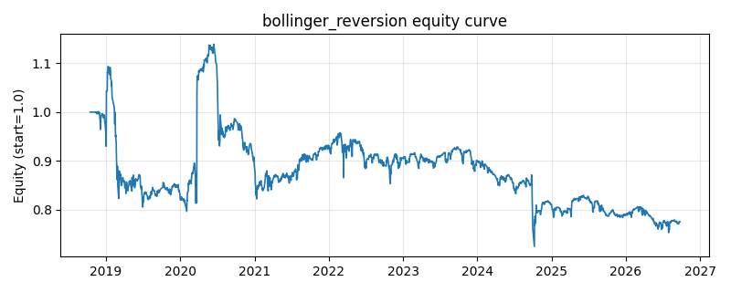

# 策略研究记录：bollinger_reversion

> 类别/途径：**meanrev** ｜ 类型：timing ｜ 方向：可多空

## 一句话思路
布林带回归：收盘跌破下轨做多、升破上轨做空，价格回到中轨附近（带内 exit_band 比例）双向平仓。

## 收集途径 / 灵感来源
经典技术分析——布林带均值回归（与 technical 渠道的 bollinger_breakout 突破逻辑相反，本仓库独立原创实现）。

## 核心假设
核心假设：布林带刻画了近期价格的常态波动区间，触及边界多为流动性冲击/过度反应，价格倾向回到中轨。失效场景：真突破行情（波动率 regime 切换）中带轨会被持续「骑乘」，逆势持仓亏损；带宽收窄期信号稀疏。

## 参数
- `window` = 20
- `num_std` = 2.0
- `entry_band` = 1.0
- `exit_band` = 0.2

## 实现要点
- 实现文件：`kairos_strategies/channels/meanrev.py`（类名对应本策略）。
- 输出统一为「目标权重面板」(date × asset)，由 `Backtester` 滞后一期执行，杜绝未来函数。
- 仅使用 numpy/pandas，离线、确定性。

## 数据与回测设置
| 项 | 值 |
|---|---|
| 数据集 | ashare_real（38 资产） |
| 区间 | 2018-10-16 ~ 2026-09-23 |
| 期数 | 1930 |
| 年化基准期数 | 252 |
| 单边成本率 | 0.1000% |
| 无风险利率 | 0.00% |

## 回测结果
| 指标 | 值 |
|---|---|
| 累计收益 | -22.45% |
| 年化收益 (CAGR) | -3.27% |
| 年化波动 | 16.45% |
| 夏普 | -0.1242 |
| 索提诺 | -0.2202 |
| 最大回撤 | 36.40% |
| 卡玛 | -0.0897 |
| 胜率 | 47.88% |
| 盈利因子 | 0.9658 |
| 平均换手 | 0.0815 |
| 累计换手 | 157.39 |

## 净值曲线

## 结论与改进方向
- 结果为 **真实历史数据（ashare_real）回测演示，存在过拟合/幸存者偏差/样本区间依赖等局限**，不构成任何投资建议或收益承诺。
- 改进方向：在真实数据上重跑、参数敏感性分析、加入波动率目标/风控叠加、与其它策略做相关性分散。
