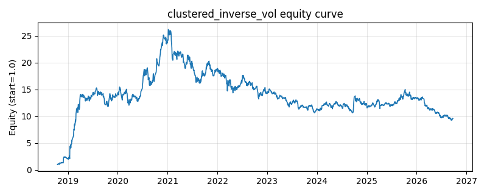

# 策略研究记录：clustered_inverse_vol

> 类别/途径：**hrp** ｜ 类型：cross_section ｜ 方向：只做多

## 一句话思路
聚类逆波动率：滚动相关距离→层次聚类切 k 簇；簇内按 1/σ 逆波动率加权，簇间等权（各 1/k），归一到每行和=1。相比全局逆波动率，先隔离相关子结构再在簇内比较波动，避免高相关资产叠加重仓。

## 收集途径 / 灵感来源
层次配置经典范式——clustered inverse volatility（聚类 + 逆波动率的原创组合实现）；scipy 缺失时聚类自动回退自研 numpy 凝聚算法，确定性打破并列。

## 核心假设
普通逆波动率忽略相关性：一簇高度相关的高波资产仍可能合计吃掉大部分资金。簇间等权把预算先均分到相关子结构，簇内再按波动倒数细分，兼得相关性分散与波动率缩放。当聚类边界在窗口间抖动时换手上升；k 过大时退化为全局逆波动率。

## 参数
- `window` = 60
- `n_clusters` = 2

## 实现要点
- 实现文件：`kairos_strategies/channels/hrp.py`（类名对应本策略）。
- 输出统一为「目标权重面板」(date × asset)，由 `Backtester` 滞后一期执行，杜绝未来函数。
- 仅使用 numpy/pandas，离线、确定性。

## 数据与回测设置
| 项 | 值 |
|---|---|
| 数据集 | ashare_real（38 资产） |
| 区间 | 2018-10-16 ~ 2026-09-23 |
| 期数 | 1930 |
| 年化基准期数 | 252 |
| 单边成本率 | 0.1000% |
| 无风险利率 | 0.00% |

## 回测结果
| 指标 | 值 |
|---|---|
| 累计收益 | 858.59% |
| 年化收益 (CAGR) | 34.33% |
| 年化波动 | 57.17% |
| 夏普 | 0.7308 |
| 索提诺 | 1.9718 |
| 最大回撤 | 64.59% |
| 卡玛 | 0.5315 |
| 胜率 | 49.17% |
| 盈利因子 | 1.2602 |
| 平均换手 | 0.1572 |
| 累计换手 | 303.32 |

## 净值曲线

## 结论与改进方向
- 结果为 **真实历史数据（ashare_real）回测演示，存在过拟合/幸存者偏差/样本区间依赖等局限**，不构成任何投资建议或收益承诺。
- 改进方向：在真实数据上重跑、参数敏感性分析、加入波动率目标/风控叠加、与其它策略做相关性分散。
