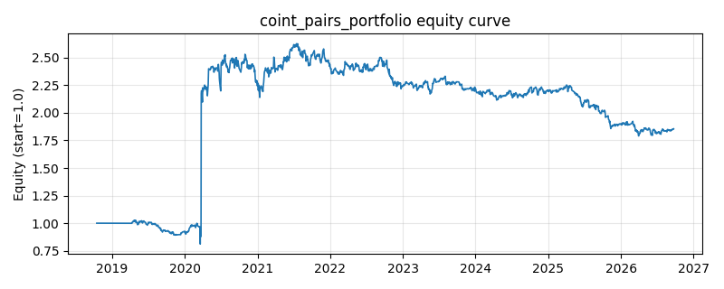

# 策略研究记录：coint_pairs_portfolio

> 类别/途径：**pairs** ｜ 类型：cross_section ｜ 方向：可多空

## 一句话思路
协整配对**组合**（Engle-Granger 两步法的自研 numpy 实现）：在再平衡网格的尾部窗口上遍历全部资产对，第一步 OLS 估对冲比率 β（logy = α + β·logx），第二步对残差同时做两道平稳性诊断——带滞后差分项的 ADF 风格单位根回归（t 统计量）与方差比 VR(q)；两道门槛都通过的对**全部入选**（按协整证据强度排序、腿不重复地贪心取前 max_pairs 对），把 gross_budget 等分到每一对，各对按残差 z-score 反向持仓（z 高做空贵腿/做多便宜腿）。每对内部两腿等预算反向，故整体逐行权重和恒为 0、绝对值和 ≤ 1。

## 收集途径 / 灵感来源
统计套利经典范式——协整配对组合（cointegrated pairs portfolio / Engle-Granger）。OLS β、带滞后项的 ADF 风格 t 统计量、方差比诊断、贪心不重复选对与预算等分全部为本仓库原创 numpy 实现，不用 statsmodels / sklearn / scipy（也不查 Dickey-Fuller 临界值表、不给 p 值，只做同序排序 + 宽松地板阈值）。与 statarb 渠道 coint_pairs 的区别：那是**单对**最优（无滞后 ADF + 半衰期门槛、以 R² 优先排序、单一 leg_budget），此处是**多对分散**（ADF + 方差比双重门槛、以协整证据强度优先排序、预算等分到每对）。

## 核心假设
核心假设：真协整的资产对存在平稳的线性组合（相对估值），偏离中枢后由套利/基本面纽带拉回；把预算分散到**多对**而非单对，可摊薄「某一对协整关系突然破裂」的特质风险，同时多空对冲剥离市场 beta，收益来源是多个价差的收敛。失效场景：多重检验下总有一些伪回归残差看起来平稳（尤其小样本），入选的对可能根本不协整；系统性压力期（流动性危机）所有价差同时走阔且不收敛，分散化在最需要时失效；β 在 block 内冻结，关系漂移会带来实现偏差。

## 参数
- `est_window` = 120
- `z_window` = 30
- `refit_freq` = 20
- `entry_z` = 1.5
- `exit_z` = 0.5
- `max_pairs` = 3
- `adf_lags` = 2
- `min_adf_t` = -2.5
- `max_half_life` = 60.0
- `vr_lag` = 5
- `max_var_ratio` = 0.75
- `exclusive_legs` = True
- `gross_budget` = 1.0

## 实现要点
- 实现文件：`kairos_strategies/channels/pairs.py`（类名对应本策略）。
- 输出统一为「目标权重面板」(date × asset)，由 `Backtester` 滞后一期执行，杜绝未来函数。
- 仅使用 numpy/pandas，离线、确定性。

## 数据与回测设置
| 项 | 值 |
|---|---|
| 数据集 | ashare_real（38 资产） |
| 区间 | 2018-10-16 ~ 2026-09-23 |
| 期数 | 1930 |
| 年化基准期数 | 252 |
| 单边成本率 | 0.1000% |
| 无风险利率 | 0.00% |

## 回测结果
| 指标 | 值 |
|---|---|
| 累计收益 | 85.49% |
| 年化收益 (CAGR) | 8.40% |
| 年化波动 | 55.01% |
| 夏普 | 0.2988 |
| 索提诺 | 1.7243 |
| 最大回撤 | 31.82% |
| 卡玛 | 0.2640 |
| 胜率 | 48.45% |
| 盈利因子 | 1.2911 |
| 平均换手 | 0.2313 |
| 累计换手 | 446.36 |

## 净值曲线

## 结论与改进方向
- 结果为 **真实历史数据（ashare_real）回测演示，存在过拟合/幸存者偏差/样本区间依赖等局限**，不构成任何投资建议或收益承诺。
- 改进方向：在真实数据上重跑、参数敏感性分析、加入波动率目标/风控叠加、与其它策略做相关性分散。
