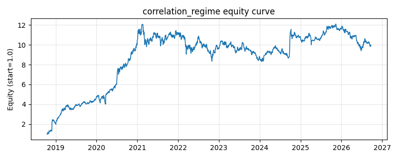

# 策略研究记录：correlation_regime

> 类别/途径：**dispersion** ｜ 类型：timing ｜ 方向：只做多

## 一句话思路
相关性状态去杠杆：滚动 corr_window 期精确估计全部资产对的平均两两相关系数 ρ̂（E[xy]−E[x]E[y] 形式向量化，逐对 Pearson 相关取均值），把 ρ̂ 经分段线性映射为总敞口 scale ∈ [expo_min, 1]：ρ̂ ≤ rho_lo（低相关，分散化有效）满仓等权，ρ̂ ≥ rho_hi（相关性飙升，危机同步）降到 expo_min，中间线性过渡；权重 = 等权(1/N) × scale（行和 = scale ≤ 1），预热期（ρ̂ 未知）回退等权满仓。

## 收集途径 / 灵感来源
相关性 regime / crisis-contagion 去杠杆范式（『correlations go to 1 in a crisis』）的纯价格日频实现；滚动平均两两相关的向量化估计、分段线性敞口映射与等权 × 缩放的组合形态均为本仓库原创，与 regime 渠道（波动分位/EM/beta 状态）的状态变量完全不同。

## 核心假设
核心假设：平均两两相关性是系统性风险同步程度的直接度量——正常市场中资产由各自的特质信息驱动，相关性低，等权分散能以低组合波动持有全部风险溢价；危机/去杠杆事件中『所有资产相关性趋近 1』，分散化收益消失，同等名义仓位承担的组合波动与尾部回撤成倍放大，而单位风险补偿并未同步升高，因此按相关性状态缩放敞口可以改善风险调整后收益并显著压低尾部回撤。相关性（而非波动率）作为状态变量的优点：它刻画的是组合层面的『分散化还剩多少』，与组合波动互补而不重复。失效场景：高相关但持续上涨的『良性同步牛市』中被减仓踏空；相关性在崩盘当天才跳升，滚动窗口使减仓滞后一个窗口；rho_lo/rho_hi 绝对锚点在不同资产类别（天然高相关的同行业股票 vs 跨资产）间需要重标定。

## 参数
- `corr_window` = 60
- `rho_lo` = 0.3
- `rho_hi` = 0.85
- `expo_min` = 0.15

## 实现要点
- 实现文件：`kairos_strategies/channels/dispersion.py`（类名对应本策略）。
- 输出统一为「目标权重面板」(date × asset)，由 `Backtester` 滞后一期执行，杜绝未来函数。
- 仅使用 numpy/pandas，离线、确定性。

## 数据与回测设置
| 项 | 值 |
|---|---|
| 数据集 | ashare_real（38 资产） |
| 区间 | 2018-10-16 ~ 2026-09-23 |
| 期数 | 1930 |
| 年化基准期数 | 252 |
| 单边成本率 | 0.1000% |
| 无风险利率 | 0.00% |

## 回测结果
| 指标 | 值 |
|---|---|
| 累计收益 | 895.33% |
| 年化收益 (CAGR) | 34.99% |
| 年化波动 | 34.20% |
| 夏普 | 1.0263 |
| 索提诺 | 2.2929 |
| 最大回撤 | 31.24% |
| 卡玛 | 1.1202 |
| 胜率 | 50.41% |
| 盈利因子 | 1.3016 |
| 平均换手 | 0.0179 |
| 累计换手 | 34.59 |

## 净值曲线

## 结论与改进方向
- 结果为 **真实历史数据（ashare_real）回测演示，存在过拟合/幸存者偏差/样本区间依赖等局限**，不构成任何投资建议或收益承诺。
- 改进方向：在真实数据上重跑、参数敏感性分析、加入波动率目标/风控叠加、与其它策略做相关性分散。
