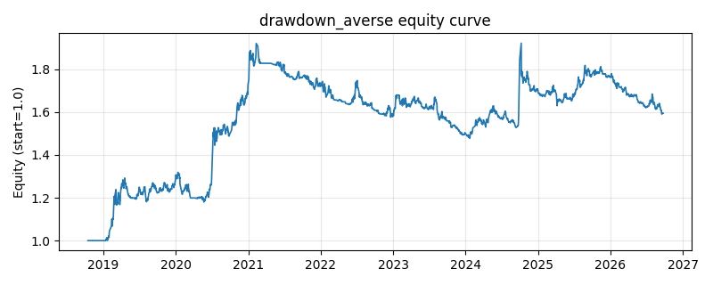

# 策略研究记录：drawdown_averse

> 类别/途径：**defensive** ｜ 类型：timing ｜ 方向：只做多

## 一句话思路
回撤规避（只做多，行和 ≤ 1）：逐资产计算当期回撤深度 dd = 1 − p/滚动 dd_window 期高点，生存度 survive = clip(1 − dd/dd_tol, 0, 1)——贴近自身滚动高点者 ≈ 1、回撤达 dd_tol 者被**完全剔除**；再乘低波倾斜 1/clip(已实现波动)，在存活资产间归一；组合层按截面中位回撤做健康度缩放 expo = clip(1 − median(dd)/dd_tol, expo_floor, 1)，即『越多的资产处于深回撤 → 整体越退向现金』。最终权重 = expo × 截面归一权重，逐行和 ≤ 1（差额为现金）；预热期（回撤/波动未知）整行空仓。

## 收集途径 / 灵感来源
防御类范式——回撤规避/回撤控制 (drawdown-averse allocation) 的本仓库原创实现；与 riskmgmt 渠道 drawdown_throttle / cppi / circuit_breaker（都是对**等权基准净值**做组合层降杠杆的 overlay）不同，此处是**逐资产**回撤闸门 + 截面低波配权 + 组合层健康度缩放三层结构；与 momentum 渠道 high_52w（把『接近新高』当动量突破做多信号）在信号语义（规避 vs 追涨）、配权（连续门限 vs 等预算）与现金处理上均不同。

## 核心假设
成因：回撤有两重防御价值——(1) 数学上，亏损的复利不对称（跌 40% 需涨 67% 才回本），压制深回撤资产的权重直接改善几何收益与最大回撤；(2) 行为/信息上，持续远离自身高点意味着抛压尚未消化、负面信息仍在扩散（动量的下行延续），而贴近滚动高点的资产说明买盘承接充分、趋势健康；叠加低波倾斜进一步回避彩票型标的。组合层的健康度缩放把『回撤的普遍性』当成系统性风险温度计：普遍深回撤时整体退向现金，而不是在矮子里拔将军继续满仓。失效场景：V 型反转——深回撤资产反弹弹性最大，剔除它们会系统性踏空（回撤信号的滞后性在拐点最贵）；震荡市中信号在 dd_tol 附近反复进出，换手与成本上升；长期慢牛中 dd 普遍很小，闸门几乎不生效（退化为纯逆波动配置）；系统性危机中所有资产同时深回撤 → 全现金，虽保住本金却完全放弃后续修复收益。

## 参数
- `dd_window` = 63
- `dd_tol` = 0.2
- `vol_window` = 21
- `vol_floor` = 0.02
- `vol_cap` = 3.0
- `expo_floor` = 0.0

## 实现要点
- 实现文件：`kairos_strategies/channels/defensive.py`（类名对应本策略）。
- 输出统一为「目标权重面板」(date × asset)，由 `Backtester` 滞后一期执行，杜绝未来函数。
- 仅使用 numpy/pandas，离线、确定性。

## 数据与回测设置
| 项 | 值 |
|---|---|
| 数据集 | ashare_real（38 资产） |
| 区间 | 2018-10-16 ~ 2026-09-23 |
| 期数 | 1930 |
| 年化基准期数 | 252 |
| 单边成本率 | 0.1000% |
| 无风险利率 | 0.00% |

## 回测结果
| 指标 | 值 |
|---|---|
| 累计收益 | 59.39% |
| 年化收益 (CAGR) | 6.28% |
| 年化波动 | 11.50% |
| 夏普 | 0.5867 |
| 索提诺 | 0.8992 |
| 最大回撤 | 23.06% |
| 卡玛 | 0.2722 |
| 胜率 | 49.42% |
| 盈利因子 | 1.1374 |
| 平均换手 | 0.0652 |
| 累计换手 | 125.89 |

## 净值曲线

## 结论与改进方向
- 结果为 **真实历史数据（ashare_real）回测演示，存在过拟合/幸存者偏差/样本区间依赖等局限**，不构成任何投资建议或收益承诺。
- 改进方向：在真实数据上重跑、参数敏感性分析、加入波动率目标/风控叠加、与其它策略做相关性分散。
