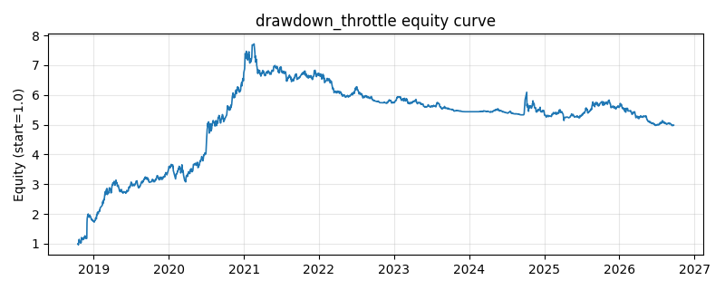

# 策略研究记录：drawdown_throttle

> 类别/途径：**riskmgmt** ｜ 类型：overlay ｜ 方向：只做多

## 一句话思路
回撤节流 overlay：实时计算等权基准净值距 expanding 历史高点的回撤 dd，总敞口 e = clip(1 - dd / max_dd, 0, 1)——回撤越大仓位越低（线性节流），回撤达到 max_dd 时降至全现金，净值收复回撤后敞口自动回升。

## 收集途径 / 灵感来源
风险管理实践——drawdown-based position sizing / 回撤控制 (drawdown control) 的组合层原创实现，等权基准 + 线性节流旋钮。

## 核心假设
核心假设：回撤具有持续性（危机传播、去杠杆螺旋、趋势下行），『正在回撤』的组合短期内更可能继续回撤，因此把回撤本身当作风险信号做连续降杠杆，可在深熊中显著压低尾部损失；与二元止损相比，线性节流避免了在阈值附近的反复全进全出。失效场景：V 型急跌急涨（节流在底部仓位最轻、反弹初期仍低仓，踏空最猛的一段）、高波动震荡市（回撤信号频繁升降导致换手放大）；max_dd 越小越保守、对噪声越敏感。

## 参数
- `max_dd` = 0.25

## 实现要点
- 实现文件：`kairos_strategies/channels/riskmgmt.py`（类名对应本策略）。
- 输出统一为「目标权重面板」(date × asset)，由 `Backtester` 滞后一期执行，杜绝未来函数。
- 仅使用 numpy/pandas，离线、确定性。

## 数据与回测设置
| 项 | 值 |
|---|---|
| 数据集 | ashare_real（38 资产） |
| 区间 | 2018-10-16 ~ 2026-09-23 |
| 期数 | 1930 |
| 年化基准期数 | 252 |
| 单边成本率 | 0.1000% |
| 无风险利率 | 0.00% |

## 回测结果
| 指标 | 值 |
|---|---|
| 累计收益 | 398.49% |
| 年化收益 (CAGR) | 23.34% |
| 年化波动 | 25.04% |
| 夏普 | 0.9509 |
| 索提诺 | 2.0140 |
| 最大回撤 | 35.62% |
| 卡玛 | 0.6551 |
| 胜率 | 50.37% |
| 盈利因子 | 1.3131 |
| 平均换手 | 0.0368 |
| 累计换手 | 71.12 |

## 净值曲线

## 结论与改进方向
- 结果为 **真实历史数据（ashare_real）回测演示，存在过拟合/幸存者偏差/样本区间依赖等局限**，不构成任何投资建议或收益承诺。
- 改进方向：在真实数据上重跑、参数敏感性分析、加入波动率目标/风控叠加、与其它策略做相关性分散。
