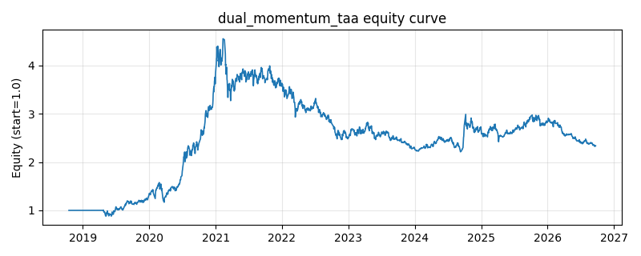

# 策略研究记录：dual_momentum_taa

> 类别/途径：**taa** ｜ 类型：cross_section ｜ 方向：只做多

## 一句话思路
双动量战术配置：相对动量在截面选出最强的 n_slots 个资产，每个槽位固定预算 1/n_slots；再用绝对动量（自身 lookback 期收益 > 同期现金累计收益）过滤，不合格的槽位直接配现金（权重 0），因此总敞口 = 合格槽位数/n_slots ≤ 1。

## 收集途径 / 灵感来源
TAA 经典范式——Antonacci 双动量 (dual momentum / GEM) 的**组合层**改写：把『股/债/现金三选一』推广为『截面 top-N 槽位 + 现金门槛过滤』，本仓库原创实现。

## 核心假设
核心假设：资产间存在相对强弱的延续性（横截面动量），同时市场整体存在方向性（绝对动量/时序动量）——先选最强、再要求它跑赢现金，可在普跌时自动把资金撤到现金而不是『矬子里拔将军』，显著压低尾部回撤。以固定槽位预算代替归一化，使现金比例成为连续的风险旋钮。失效场景：动量崩溃（急跌后 V 型反转，刚刚转现金即踏空）、宽幅震荡市中强弱频繁轮换带来的换手成本、以及现金利率接近 0 时绝对动量门槛过低导致过滤形同虚设。

## 参数
- `lookback` = 126
- `top_frac` = 0.3333333333333333
- `cash_annual` = 0.02

## 实现要点
- 实现文件：`kairos_strategies/channels/taa.py`（类名对应本策略）。
- 输出统一为「目标权重面板」(date × asset)，由 `Backtester` 滞后一期执行，杜绝未来函数。
- 仅使用 numpy/pandas，离线、确定性。

## 数据与回测设置
| 项 | 值 |
|---|---|
| 数据集 | ashare_real（38 资产） |
| 区间 | 2018-10-16 ~ 2026-09-23 |
| 期数 | 1930 |
| 年化基准期数 | 252 |
| 单边成本率 | 0.1000% |
| 无风险利率 | 0.00% |

## 回测结果
| 指标 | 值 |
|---|---|
| 累计收益 | 133.64% |
| 年化收益 (CAGR) | 11.72% |
| 年化波动 | 24.30% |
| 夏普 | 0.5777 |
| 索提诺 | 0.8386 |
| 最大回撤 | 51.40% |
| 卡玛 | 0.2280 |
| 胜率 | 50.89% |
| 盈利因子 | 1.1156 |
| 平均换手 | 0.1248 |
| 累计换手 | 240.96 |

## 净值曲线

## 结论与改进方向
- 结果为 **真实历史数据（ashare_real）回测演示，存在过拟合/幸存者偏差/样本区间依赖等局限**，不构成任何投资建议或收益承诺。
- 改进方向：在真实数据上重跑、参数敏感性分析、加入波动率目标/风控叠加、与其它策略做相关性分散。
