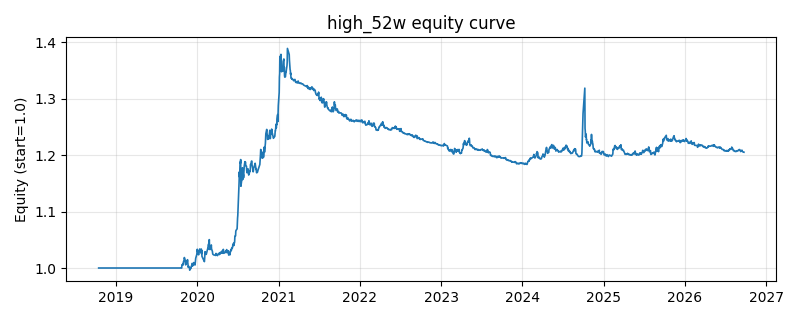

# 策略研究记录：high_52w

> 类别/途径：**momentum** ｜ 类型：timing ｜ 方向：只做多

## 一句话思路
52周新高接近度：价格越接近滚动 window 期最高价权重越高，低于阈值则空仓（等预算 1/N）。

## 收集途径 / 灵感来源
动量范式——52周新高接近度 52-week-high proximity（George-Hwang 思路，原创实现）。

## 核心假设
锚定效应使投资者不愿追高，接近历史高点的价格蕴含上行惯性；接近度捕捉突破动能；在假突破/见顶急跌时失效。

## 参数
- `window` = 250
- `threshold` = 0.9

## 实现要点
- 实现文件：`kairos_strategies/channels/momentum.py`（类名对应本策略）。
- 输出统一为「目标权重面板」(date × asset)，由 `Backtester` 滞后一期执行，杜绝未来函数。
- 仅使用 numpy/pandas，离线、确定性。

## 数据与回测设置
| 项 | 值 |
|---|---|
| 数据集 | ashare_real（38 资产） |
| 区间 | 2018-10-16 ~ 2026-09-23 |
| 期数 | 1930 |
| 年化基准期数 | 252 |
| 单边成本率 | 0.1000% |
| 无风险利率 | 0.00% |

## 回测结果
| 指标 | 值 |
|---|---|
| 累计收益 | 20.54% |
| 年化收益 (CAGR) | 2.47% |
| 年化波动 | 5.25% |
| 夏普 | 0.4905 |
| 索提诺 | 0.7249 |
| 最大回撤 | 14.81% |
| 卡玛 | 0.1667 |
| 胜率 | 47.77% |
| 盈利因子 | 1.1471 |
| 平均换手 | 0.0314 |
| 累计换手 | 60.53 |

## 净值曲线

## 结论与改进方向
- 结果为 **真实历史数据（ashare_real）回测演示，存在过拟合/幸存者偏差/样本区间依赖等局限**，不构成任何投资建议或收益承诺。
- 改进方向：在真实数据上重跑、参数敏感性分析、加入波动率目标/风控叠加、与其它策略做相关性分散。
