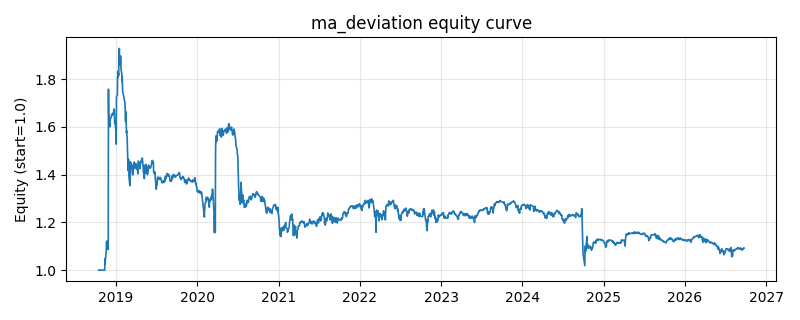

# 策略研究记录：ma_deviation

> 类别/途径：**meanrev** ｜ 类型：timing ｜ 方向：可多空

## 一句话思路
均线偏离回归：价格相对 N 期均线的百分比偏离显著为负做多、显著为正做空，偏离收敛回均线附近（滞后带）平仓以降低换手。

## 收集途径 / 灵感来源
经典技术分析——均线乖离率(BIAS)回归，本仓库原创实现（指标复用自研 indicators.sma）。

## 核心假设
核心假设：均线代表近期持仓成本中枢，价格远离成本中枢后存在回归拉力（过度反应修正）。失效场景：单边趋势中偏离会长期维持在同一侧（均线追随），策略逆势加仓并承受回撤；低波动期偏离不足，几乎不交易。

## 参数
- `window` = 20
- `entry_dev` = 0.05
- `exit_dev` = 0.015

## 实现要点
- 实现文件：`kairos_strategies/channels/meanrev.py`（类名对应本策略）。
- 输出统一为「目标权重面板」(date × asset)，由 `Backtester` 滞后一期执行，杜绝未来函数。
- 仅使用 numpy/pandas，离线、确定性。

## 数据与回测设置
| 项 | 值 |
|---|---|
| 数据集 | ashare_real（38 资产） |
| 区间 | 2018-10-16 ~ 2026-09-23 |
| 期数 | 1930 |
| 年化基准期数 | 252 |
| 单边成本率 | 0.1000% |
| 无风险利率 | 0.00% |

## 回测结果
| 指标 | 值 |
|---|---|
| 累计收益 | 9.28% |
| 年化收益 (CAGR) | 1.17% |
| 年化波动 | 29.06% |
| 夏普 | 0.1580 |
| 索提诺 | 0.4094 |
| 最大回撤 | 47.22% |
| 卡玛 | 0.0247 |
| 胜率 | 49.19% |
| 盈利因子 | 1.0644 |
| 平均换手 | 0.0949 |
| 累计换手 | 183.07 |

## 净值曲线

## 结论与改进方向
- 结果为 **真实历史数据（ashare_real）回测演示，存在过拟合/幸存者偏差/样本区间依赖等局限**，不构成任何投资建议或收益承诺。
- 改进方向：在真实数据上重跑、参数敏感性分析、加入波动率目标/风控叠加、与其它策略做相关性分散。
