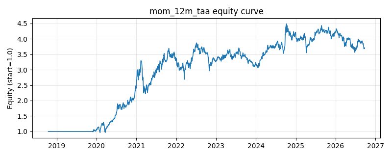

# 策略研究记录：mom_12m_taa

> 类别/途径：**taa** ｜ 类型：cross_section ｜ 方向：只做多

## 一句话思路
经典 12-1 动量战术配置：按 p[t-21]/p[t-273]-1（约 12 个月动量、剔除近 1 个月反转）截面排序，做多前 n_slots 个资产、每槽固定预算 1/n_slots；每 rebal 期再平衡一次，其间买入持有按净值漂移（不产生杠杆）；动量 ≤ 0 的槽位用现金替代，故总敞口 = 合格槽位数/n_slots ≤ 1。

## 收集途径 / 灵感来源
TAA 经典范式——Jegadeesh-Titman 12-1 横截面动量的**月度再平衡 + 现金替代**组合层实现（含买入持有漂移的净值归一递推），本仓库原创。

## 核心假设
核心假设：12 个月减 1 个月的动量是横截面动量最经典的窗口——长窗口捕捉持续性资金流与基本面渐进扩散，跳过最近 1 个月规避短期反转与流动性冲击的污染。低频（月度）再平衡 + 期间漂移把换手与交易成本压到最低，符合真实 TAA 组合的运作方式；叠加『负动量转现金』的绝对门槛后，熊市里组合自动降敞口而非被动持有最抗跌者。失效场景：动量崩溃（政策底后的急速普涨反转）、市场风格季度内切换、以及资产数很少时 top-N 的截面区分度不足。

## 参数
- `lookback` = 252
- `skip` = 21
- `top_frac` = 0.25
- `rebal` = 21

## 实现要点
- 实现文件：`kairos_strategies/channels/taa.py`（类名对应本策略）。
- 输出统一为「目标权重面板」(date × asset)，由 `Backtester` 滞后一期执行，杜绝未来函数。
- 仅使用 numpy/pandas，离线、确定性。

## 数据与回测设置
| 项 | 值 |
|---|---|
| 数据集 | ashare_real（38 资产） |
| 区间 | 2018-10-16 ~ 2026-09-23 |
| 期数 | 1930 |
| 年化基准期数 | 252 |
| 单边成本率 | 0.1000% |
| 无风险利率 | 0.00% |

## 回测结果
| 指标 | 值 |
|---|---|
| 累计收益 | 269.72% |
| 年化收益 (CAGR) | 18.62% |
| 年化波动 | 24.50% |
| 夏普 | 0.8200 |
| 索提诺 | 1.1974 |
| 最大回撤 | 32.39% |
| 卡玛 | 0.5748 |
| 胜率 | 51.06% |
| 盈利因子 | 1.1699 |
| 平均换手 | 0.0198 |
| 累计换手 | 38.30 |

## 净值曲线

## 结论与改进方向
- 结果为 **真实历史数据（ashare_real）回测演示，存在过拟合/幸存者偏差/样本区间依赖等局限**，不构成任何投资建议或收益承诺。
- 改进方向：在真实数据上重跑、参数敏感性分析、加入波动率目标/风控叠加、与其它策略做相关性分散。
