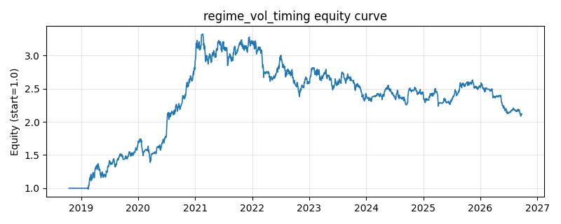

# 策略研究记录：regime_vol_timing

> 类别/途径：**regime** ｜ 类型：overlay ｜ 方向：只做多

## 一句话思路
多档分位波动状态择时：对等权市场组合的已实现波动计算其在过去 lookback 期历史分布中的分位（mid-rank），以 q_low/q_mid 两个分位锚点划分低/中/高三档状态，总敞口按分位分段线性连续缩放 1.0 → scale_mid → scale_high：低波满仓、中波按比例降、高波深度降杠杆，差额即现金（每资产 scale/N）。

## 收集途径 / 灵感来源
波动率 regime switching 范式的「多档分位 + 连续缩放」改写（与 volatility 渠道二元 vol_regime_filter 互补，档位映射与 mid-rank 分位为本仓库原创实现）。

## 核心假设
核心假设：波动率有强聚集性（状态可短期预测），且高波动状态下单位风险收益系统性更差（杠杆效应、被迫去杠杆、流动性收缩）。滚动分位使阈值自适应不同时代/资产的波动水平；相对二元开关（如 vol_regime_filter），多档连续缩放把『状态强度』映射为『仓位强度』，避免在阈值附近满仓/空仓来回跳变，换手更低、敞口路径更平滑。失效场景：低波平静期后的突发崩盘（分位阈值滞后于跳升的波动，减仓晚一步）、高波动伴随强反弹的市场（深度降杠杆踏空）、以及波动水平长期漂移时分位的相对性导致『新常态』被误判为高波状态。

## 参数
- `vol_window` = 20
- `lookback` = 250
- `min_obs` = 60
- `q_low` = 0.4
- `q_mid` = 0.8
- `scale_mid` = 0.6
- `scale_high` = 0.2
- `vol_floor` = 0.01

## 实现要点
- 实现文件：`kairos_strategies/channels/regime.py`（类名对应本策略）。
- 输出统一为「目标权重面板」(date × asset)，由 `Backtester` 滞后一期执行，杜绝未来函数。
- 仅使用 numpy/pandas，离线、确定性。

## 数据与回测设置
| 项 | 值 |
|---|---|
| 数据集 | ashare_real（38 资产） |
| 区间 | 2018-10-16 ~ 2026-09-23 |
| 期数 | 1930 |
| 年化基准期数 | 252 |
| 单边成本率 | 0.1000% |
| 无风险利率 | 0.00% |

## 回测结果
| 指标 | 值 |
|---|---|
| 累计收益 | 111.47% |
| 年化收益 (CAGR) | 10.27% |
| 年化波动 | 18.64% |
| 夏普 | 0.6179 |
| 索提诺 | 0.9088 |
| 最大回撤 | 37.29% |
| 卡玛 | 0.2755 |
| 胜率 | 50.08% |
| 盈利因子 | 1.1222 |
| 平均换手 | 0.0299 |
| 累计换手 | 57.70 |

## 净值曲线

## 结论与改进方向
- 结果为 **真实历史数据（ashare_real）回测演示，存在过拟合/幸存者偏差/样本区间依赖等局限**，不构成任何投资建议或收益承诺。
- 改进方向：在真实数据上重跑、参数敏感性分析、加入波动率目标/风控叠加、与其它策略做相关性分散。
