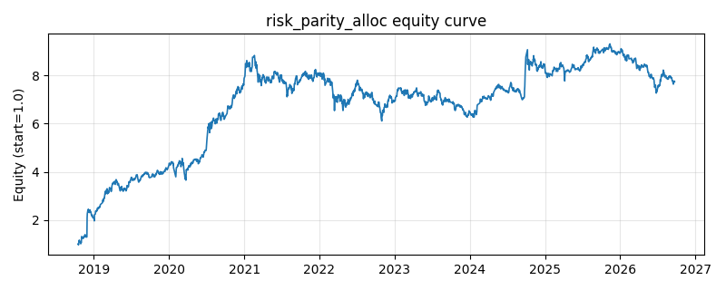

# 策略研究记录：risk_parity_alloc

> 类别/途径：**allocation** ｜ 类型：cross_section ｜ 方向：只做多

## 一句话思路
风险平价(ERC)：用滚动样本协方差，自研牛顿迭代（对数障碍凸形式 + 回溯线搜索）使各资产成分风险贡献 wᵢ(Σw)ᵢ 相等，归一到每行和=1。

## 收集途径 / 灵感来源
组合配置经典范式——Equal Risk Contribution / Risk Parity（Maillard-Roncalli-Teïletche 思想），牛顿迭代求解为本仓库原创纯 numpy 实现。

## 核心假设
等风险贡献让组合风险在资产间均衡分散，而非被少数高波/高相关资产垄断，在风险维度（而非资金维度）做分散化，长期风险调整后收益更稳健。当风险因子高度共振（危机中相关性趋 1）时『分散化幻觉』破裂，可能出现同步回撤。

## 参数
- `window` = 60
- `max_iters` = 50
- `tol` = 1e-10

## 实现要点
- 实现文件：`kairos_strategies/channels/allocation.py`（类名对应本策略）。
- 输出统一为「目标权重面板」(date × asset)，由 `Backtester` 滞后一期执行，杜绝未来函数。
- 仅使用 numpy/pandas，离线、确定性。

## 数据与回测设置
| 项 | 值 |
|---|---|
| 数据集 | ashare_real（38 资产） |
| 区间 | 2018-10-16 ~ 2026-09-23 |
| 期数 | 1930 |
| 年化基准期数 | 252 |
| 单边成本率 | 0.1000% |
| 无风险利率 | 0.00% |

## 回测结果
| 指标 | 值 |
|---|---|
| 累计收益 | 674.65% |
| 年化收益 (CAGR) | 30.64% |
| 年化波动 | 32.68% |
| 夏普 | 0.9590 |
| 索提诺 | 2.1479 |
| 最大回撤 | 30.84% |
| 卡玛 | 0.9937 |
| 胜率 | 51.35% |
| 盈利因子 | 1.2864 |
| 平均换手 | 0.0340 |
| 累计换手 | 65.68 |

## 净值曲线

## 结论与改进方向
- 结果为 **真实历史数据（ashare_real）回测演示，存在过拟合/幸存者偏差/样本区间依赖等局限**，不构成任何投资建议或收益承诺。
- 改进方向：在真实数据上重跑、参数敏感性分析、加入波动率目标/风控叠加、与其它策略做相关性分散。
