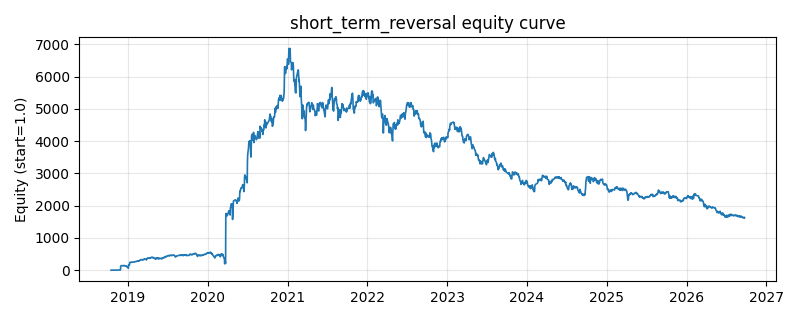

# 策略研究记录：short_term_reversal

> 类别/途径：**factor** ｜ 类型：cross_section ｜ 方向：只做多

## 一句话思路
短期反转：按过去短窗口收益升序排名，做多近期跌幅最大的一篮子，跌得越多权重越高。

## 收集途径 / 灵感来源
因子异象——短期反转 (short-term reversal)，纯价格构造。

## 核心假设
流动性冲击与投资者过度反应使近端价格短暂偏离，随后做市商回补与均值回归推动反弹；做多最近大幅下跌的一篮子可捕捉这种短期修复。当下跌由基本面恶化（信息驱动）主导，或市场处于持续单边趋势时，反转会失效甚至放大亏损。

## 参数
- `lookback` = 5
- `top_frac` = 0.3333333333333333

## 实现要点
- 实现文件：`kairos_strategies/channels/factor.py`（类名对应本策略）。
- 输出统一为「目标权重面板」(date × asset)，由 `Backtester` 滞后一期执行，杜绝未来函数。
- 仅使用 numpy/pandas，离线、确定性。

## 数据与回测设置
| 项 | 值 |
|---|---|
| 数据集 | ashare_real（38 资产） |
| 区间 | 2018-10-16 ~ 2026-09-23 |
| 期数 | 1930 |
| 年化基准期数 | 252 |
| 单边成本率 | 0.1000% |
| 无风险利率 | 0.00% |

## 回测结果
| 指标 | 值 |
|---|---|
| 累计收益 | 162964.17% |
| 年化收益 (CAGR) | 162.69% |
| 年化波动 | 642.42% |
| 夏普 | 0.5982 |
| 索提诺 | 10.5811 |
| 最大回撤 | 76.46% |
| 卡玛 | 2.1278 |
| 胜率 | 48.31% |
| 盈利因子 | 2.8277 |
| 平均换手 | 0.8009 |
| 累计换手 | 1545.79 |

## 净值曲线

## 结论与改进方向
- 结果为 **真实历史数据（ashare_real）回测演示，存在过拟合/幸存者偏差/样本区间依赖等局限**，不构成任何投资建议或收益承诺。
- 改进方向：在真实数据上重跑、参数敏感性分析、加入波动率目标/风控叠加、与其它策略做相关性分散。
