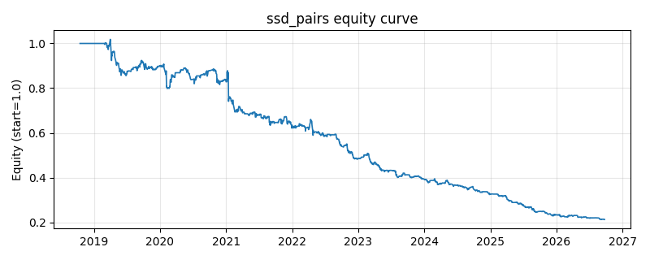

# 策略研究记录：ssd_pairs

> 类别/途径：**pairs** ｜ 类型：cross_section ｜ 方向：可多空

## 一句话思路
距离法（SSD）配对交易：在形成期窗口内把每只价格除以窗口首日价格做归一化，用一次矩阵乘法算出全部资产对的归一化路径平方差之和 SSD，取「历史走势最像」的一对（SSD 最小，并列按资产索引字典序）；交易期沿用同一归一化基准构造价差 norm_y - norm_x，对其做尾部滚动 z-score：价差被高估(z 高)则做空 y 腿/做多 x 腿，被低估则反向，两腿等预算反向，组合逐行权重和恒为 0。每 refit_freq 期重新选对。

## 收集途径 / 灵感来源
配对交易距离法（distance approach / Sum of Squared Difference）经典范式——Gatev, Goetzmann & Rouwenhorst (2006) 的自研 numpy 实现：归一化价格、SSD 矩阵、最接近对筛选与价差 z-score 全部本仓库原创。与 statarb 渠道 coint_pairs（协整门槛 + 估 β + ADF/半衰期诊断，只取统计上最显著的一对）、meanrev 渠道 pairs_spread（固定两腿、β=1 的对数价差 + 三态状态机）均不同：此处**不做任何平稳性检验、不估 β**，纯按价格路径距离选对，且用死区+斜坡的连续仓位而非离散三态。

## 核心假设
核心假设：历史上价格走势最贴近的两只资产，往往受同一基本面/资金纽带约束，短期背离多为流动性冲击造成的临时错价，会向「历史最像」的关系收敛，故按价差 z-score 反向持仓可获得收敛收益，且两腿对冲掉市场 beta。失效场景：SSD 只度量过去的**几何相似度**、不检验价差的平稳性，可能选中两只同涨同跌的趋势资产（相似但都非平稳），此时价差发散；相似度排名频繁换位会带来换手，且窗口内发生结构性变化（并购、政策）时形成期本身已失效。

## 参数
- `formation_window` = 90
- `z_window` = 30
- `refit_freq` = 10
- `entry_z` = 1.5
- `exit_z` = 0.5
- `leg_budget` = 0.5

## 实现要点
- 实现文件：`kairos_strategies/channels/pairs.py`（类名对应本策略）。
- 输出统一为「目标权重面板」(date × asset)，由 `Backtester` 滞后一期执行，杜绝未来函数。
- 仅使用 numpy/pandas，离线、确定性。

## 数据与回测设置
| 项 | 值 |
|---|---|
| 数据集 | ashare_real（38 资产） |
| 区间 | 2018-10-16 ~ 2026-09-23 |
| 期数 | 1930 |
| 年化基准期数 | 252 |
| 单边成本率 | 0.1000% |
| 无风险利率 | 0.00% |

## 回测结果
| 指标 | 值 |
|---|---|
| 累计收益 | -78.75% |
| 年化收益 (CAGR) | -18.31% |
| 年化波动 | 11.80% |
| 夏普 | -1.6527 |
| 索提诺 | -2.0030 |
| 最大回撤 | 79.17% |
| 卡玛 | -0.2312 |
| 胜率 | 42.38% |
| 盈利因子 | 0.6793 |
| 平均换手 | 0.2731 |
| 累计换手 | 527.03 |

## 净值曲线

## 结论与改进方向
- 结果为 **真实历史数据（ashare_real）回测演示，存在过拟合/幸存者偏差/样本区间依赖等局限**，不构成任何投资建议或收益承诺。
- 改进方向：在真实数据上重跑、参数敏感性分析、加入波动率目标/风控叠加、与其它策略做相关性分散。
