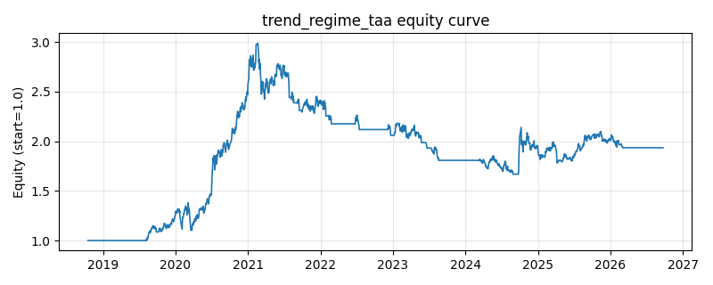

# 策略研究记录：trend_regime_taa

> 类别/途径：**taa** ｜ 类型：cross_section ｜ 方向：只做多

## 一句话思路
趋势状态战术配置：以等权组合净值指数作为『市场』代理，指数高于其 ma_window 期均线（含 ±buffer 滞后带，状态机持有）时满仓持有风险 sleeve（等权或正动量加权），跌破均线时全部转为现金（risk-off，总敞口 0）。

## 收集途径 / 灵感来源
TAA 经典范式——趋势跟随 / 200 日均线择时 (trend regime、time-series momentum overlay) 的多资产组合层实现，本仓库原创。

## 核心假设
核心假设：大类资产/宽基市场存在可持续数月的趋势状态（牛熊切换），长期均线是最简单稳健的状态判别器——在均线之上时承担风险、之下时退到现金，可截断熊市左尾、以少量震荡市的假信号成本换取回撤的大幅下降。buffer 滞后带 + 状态机持有降低在均线附近反复进出的换手。失效场景：无方向的箱体震荡（连续假突破、反复挨打）、V 型急跌急涨（均线滞后导致既没躲过下跌又踏空反弹）、以及均线窗口与市场周期错配时。

## 参数
- `ma_window` = 200
- `buffer` = 0.01
- `sleeve` = equal
- `mom_window` = 63

## 实现要点
- 实现文件：`kairos_strategies/channels/taa.py`（类名对应本策略）。
- 输出统一为「目标权重面板」(date × asset)，由 `Backtester` 滞后一期执行，杜绝未来函数。
- 仅使用 numpy/pandas，离线、确定性。

## 数据与回测设置
| 项 | 值 |
|---|---|
| 数据集 | ashare_real（38 资产） |
| 区间 | 2018-10-16 ~ 2026-09-23 |
| 期数 | 1930 |
| 年化基准期数 | 252 |
| 单边成本率 | 0.1000% |
| 无风险利率 | 0.00% |

## 回测结果
| 指标 | 值 |
|---|---|
| 累计收益 | 93.53% |
| 年化收益 (CAGR) | 9.00% |
| 年化波动 | 17.55% |
| 夏普 | 0.5792 |
| 索提诺 | 0.8380 |
| 最大回撤 | 44.24% |
| 卡玛 | 0.2035 |
| 胜率 | 50.54% |
| 盈利因子 | 1.1442 |
| 平均换手 | 0.0258 |
| 累计换手 | 49.79 |

## 净值曲线

## 结论与改进方向
- 结果为 **真实历史数据（ashare_real）回测演示，存在过拟合/幸存者偏差/样本区间依赖等局限**，不构成任何投资建议或收益承诺。
- 改进方向：在真实数据上重跑、参数敏感性分析、加入波动率目标/风控叠加、与其它策略做相关性分散。
