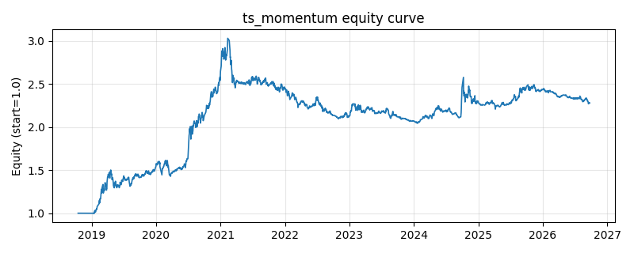

# 策略研究记录：ts_momentum

> 类别/途径：**momentum** ｜ 类型：timing ｜ 方向：只做多

## 一句话思路
时序动量：过去 N 期累计收益为正则做多该资产、为负则空仓（等预算 1/N）。

## 收集途径 / 灵感来源
动量范式——时序动量 time-series momentum（Moskowitz-Ooi-Pedersen 思路，原创实现）。

## 核心假设
价格存在中期趋势延续（正自相关），顺势持有可获取动量溢价；在震荡反转或趋势急转时失效。

## 参数
- `lookback` = 60

## 实现要点
- 实现文件：`kairos_strategies/channels/momentum.py`（类名对应本策略）。
- 输出统一为「目标权重面板」(date × asset)，由 `Backtester` 滞后一期执行，杜绝未来函数。
- 仅使用 numpy/pandas，离线、确定性。

## 数据与回测设置
| 项 | 值 |
|---|---|
| 数据集 | ashare_real（38 资产） |
| 区间 | 2018-10-16 ~ 2026-09-23 |
| 期数 | 1930 |
| 年化基准期数 | 252 |
| 单边成本率 | 0.1000% |
| 无风险利率 | 0.00% |

## 回测结果
| 指标 | 值 |
|---|---|
| 累计收益 | 127.96% |
| 年化收益 (CAGR) | 11.36% |
| 年化波动 | 15.33% |
| 夏普 | 0.7785 |
| 索提诺 | 1.1543 |
| 最大回撤 | 32.56% |
| 卡玛 | 0.3488 |
| 胜率 | 50.59% |
| 盈利因子 | 1.1781 |
| 平均换手 | 0.0617 |
| 累计换手 | 119.14 |

## 净值曲线

## 结论与改进方向
- 结果为 **真实历史数据（ashare_real）回测演示，存在过拟合/幸存者偏差/样本区间依赖等局限**，不构成任何投资建议或收益承诺。
- 改进方向：在真实数据上重跑、参数敏感性分析、加入波动率目标/风控叠加、与其它策略做相关性分散。
