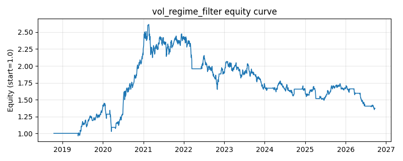

# 策略研究记录：vol_regime_filter

> 类别/途径：**volatility** ｜ 类型：overlay ｜ 方向：只做多

## 一句话思路
波动率 regime 过滤：等权组合的已实现波动低于其滚动分位阈值（默认 70% 分位）时满仓等权，突破极端高波分位（默认 90%）时空仓（risk-off），双分位滞后带减少状态抖动。

## 收集途径 / 灵感来源
波动率 regime switching / risk-off 择时过滤范式（本仓库原创实现）。

## 核心假设
核心假设：波动率状态可预测（聚集性）且高波动状态下的收益分布显著更差、更偏负（低波动异象 + 波动率与收益的负相关）。用**滚动分位**而非绝对阈值可自适应不同资产/时代的波动水平；双分位（进/出）滞后带避免临界抖动。失效场景：低波之后的突发崩盘（分位阈值滞后于跳升的波动）、以及高波动伴随强反弹的市场（如政策底后的急涨）会踏空；lookback 越长越稳但反应越慢。

## 参数
- `vol_window` = 20
- `lookback` = 250
- `q_enter` = 0.7
- `q_exit` = 0.9
- `vol_floor` = 0.01

## 实现要点
- 实现文件：`kairos_strategies/channels/volatility.py`（类名对应本策略）。
- 输出统一为「目标权重面板」(date × asset)，由 `Backtester` 滞后一期执行，杜绝未来函数。
- 仅使用 numpy/pandas，离线、确定性。

## 数据与回测设置
| 项 | 值 |
|---|---|
| 数据集 | ashare_real（38 资产） |
| 区间 | 2018-10-16 ~ 2026-09-23 |
| 期数 | 1930 |
| 年化基准期数 | 252 |
| 单边成本率 | 0.1000% |
| 无风险利率 | 0.00% |

## 回测结果
| 指标 | 值 |
|---|---|
| 累计收益 | 37.00% |
| 年化收益 (CAGR) | 4.20% |
| 年化波动 | 18.76% |
| 夏普 | 0.3132 |
| 索提诺 | 0.4443 |
| 最大回撤 | 48.37% |
| 卡玛 | 0.0868 |
| 胜率 | 49.74% |
| 盈利因子 | 1.0648 |
| 平均换手 | 0.0222 |
| 累计换手 | 42.89 |

## 净值曲线

## 结论与改进方向
- 结果为 **真实历史数据（ashare_real）回测演示，存在过拟合/幸存者偏差/样本区间依赖等局限**，不构成任何投资建议或收益承诺。
- 改进方向：在真实数据上重跑、参数敏感性分析、加入波动率目标/风控叠加、与其它策略做相关性分散。
