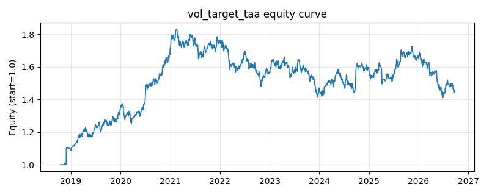

# 策略研究记录：vol_target_taa

> 类别/途径：**taa** ｜ 类型：cross_section ｜ 方向：只做多

## 一句话思路
组合波动率目标战术配置：风险 sleeve 用滚动逆波动率加权（行内归一到 1），再按 scale = clip(目标波动 / sleeve 已实现波动(EWMA 年化), 0, 1) 缩放总敞口，scale < 1 的差额即为现金；波动越高仓位越低，缩放上限 1（不加杠杆）。

## 收集途径 / 灵感来源
TAA 风险管理范式——组合层 volatility targeting / 风险预算缩放（目标波动 - 现金二元配置），EWMA 波动与逆波动率 sleeve 均为本仓库原创实现。

## 核心假设
核心假设：波动率有强聚集性与可预测性，且高波动期单位风险补偿更差（去杠杆、流动性收缩、杠杆效应），把组合波动锁定在目标水平能显著改善风险调整后收益并压低下行尾部。与单资产择时不同，这里直接对**组合 sleeve 的已实现波动**（含相关性效应）做目标控制，比用单资产波动近似更准确；EWMA 对波动突变反应快于等权滚动窗口。失效场景：目标波动长期高于市场已实现波动时退化为满仓持有（不加杠杆故无超额收益）、波动骤升后急速回落的 V 型行情中因滞后而踏空、以及波动与收益正相关的上行加速阶段会被系统性降仓。

## 参数
- `target_vol` = 0.1
- `vol_span` = 20
- `sleeve_window` = 60
- `vol_floor` = 0.02
- `max_scale` = 1.0
- `min_scale` = 0.0

## 实现要点
- 实现文件：`kairos_strategies/channels/taa.py`（类名对应本策略）。
- 输出统一为「目标权重面板」(date × asset)，由 `Backtester` 滞后一期执行，杜绝未来函数。
- 仅使用 numpy/pandas，离线、确定性。

## 数据与回测设置
| 项 | 值 |
|---|---|
| 数据集 | ashare_real（38 资产） |
| 区间 | 2018-10-16 ~ 2026-09-23 |
| 期数 | 1930 |
| 年化基准期数 | 252 |
| 单边成本率 | 0.1000% |
| 无风险利率 | 0.00% |

## 回测结果
| 指标 | 值 |
|---|---|
| 累计收益 | 45.33% |
| 年化收益 (CAGR) | 5.00% |
| 年化波动 | 11.07% |
| 夏普 | 0.4960 |
| 索提诺 | 0.7479 |
| 最大回撤 | 22.91% |
| 卡玛 | 0.2183 |
| 胜率 | 50.29% |
| 盈利因子 | 1.0939 |
| 平均换手 | 0.0301 |
| 累计换手 | 58.14 |

## 净值曲线

## 结论与改进方向
- 结果为 **真实历史数据（ashare_real）回测演示，存在过拟合/幸存者偏差/样本区间依赖等局限**，不构成任何投资建议或收益承诺。
- 改进方向：在真实数据上重跑、参数敏感性分析、加入波动率目标/风控叠加、与其它策略做相关性分散。
