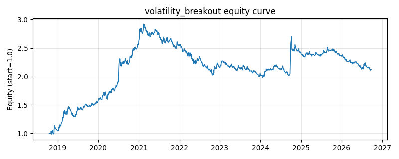

# 策略研究记录：volatility_breakout

> 类别/途径：**breakout** ｜ 类型：timing ｜ 方向：只做多

## 一句话思路
波动率突破（Larry Williams 范式的收盘价适配）：触发价 = 前收 + k_entry×近期波幅（|close.diff()| 的 M 日均值，滞后一期），当日收盘站上触发价做多；收盘跌破「前收 - k_exit×波幅」的回落大阴线立即离场，否则最多持有 max_hold 期强制离场（时间止损，近似日内策略的次日/限期离场），持有期内触发价再次突破则重置计时。

## 收集途径 / 灵感来源
经典日内突破范式——Larry Williams 波动率突破 (volatility breakout) 的收盘价适配（本仓库原创实现）。

## 核心假设
核心假设：单日超出近期常态波幅的向上位移是「日内动能爆发」的信号，动量在短期内（数日）延续，但会快速衰减——因此用时间止损限期持有、见反向大阴线立即离场，把每次突破当作一笔短线的动能交易而非趋势跟踪。失效场景：突破后立即反转的假突破/猎杀止损行情（靠 k_exit 反向触发价快速止血）；低波动背景下的微小位移也会触发（用 range_floor_pct 波幅下限缓解）；持续单边趋势中因限期离场而跑输趋势跟踪策略。

## 参数
- `range_window` = 10
- `k_entry` = 1.2
- `k_exit` = 1.2
- `max_hold` = 10
- `range_floor_pct` = 0.002

## 实现要点
- 实现文件：`kairos_strategies/channels/breakout.py`（类名对应本策略）。
- 输出统一为「目标权重面板」(date × asset)，由 `Backtester` 滞后一期执行，杜绝未来函数。
- 仅使用 numpy/pandas，离线、确定性。

## 数据与回测设置
| 项 | 值 |
|---|---|
| 数据集 | ashare_real（38 资产） |
| 区间 | 2018-10-16 ~ 2026-09-23 |
| 期数 | 1930 |
| 年化基准期数 | 252 |
| 单边成本率 | 0.1000% |
| 无风险利率 | 0.00% |

## 回测结果
| 指标 | 值 |
|---|---|
| 累计收益 | 112.27% |
| 年化收益 (CAGR) | 10.33% |
| 年化波动 | 14.20% |
| 夏普 | 0.7625 |
| 索提诺 | 1.2586 |
| 最大回撤 | 32.14% |
| 卡玛 | 0.3213 |
| 胜率 | 47.99% |
| 盈利因子 | 1.1705 |
| 平均换手 | 0.1681 |
| 累计换手 | 324.38 |

## 净值曲线

## 结论与改进方向
- 结果为 **真实历史数据（ashare_real）回测演示，存在过拟合/幸存者偏差/样本区间依赖等局限**，不构成任何投资建议或收益承诺。
- 改进方向：在真实数据上重跑、参数敏感性分析、加入波动率目标/风控叠加、与其它策略做相关性分散。
