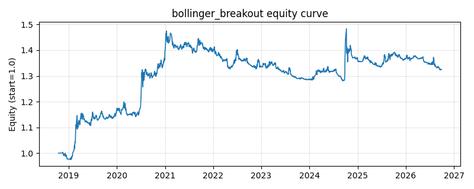

# 策略研究记录：bollinger_breakout

> 类别/途径：**technical** ｜ 类型：timing ｜ 方向：只做多

## 一句话思路
布林带突破：收盘上穿上轨做多，回落至中轨下方离场。

## 收集途径 / 灵感来源
经典技术分析——布林带突破。

## 核心假设
突破上轨代表强势启动，趋势延续至均值附近。

## 参数
- `window` = 20
- `num_std` = 2.0

## 实现要点
- 实现文件：`kairos_strategies/channels/technical.py`（类名对应本策略）。
- 输出统一为「目标权重面板」(date × asset)，由 `Backtester` 滞后一期执行，杜绝未来函数。
- 仅使用 numpy/pandas，离线、确定性。

## 数据与回测设置
| 项 | 值 |
|---|---|
| 数据集 | ashare_real（60 资产） |
| 区间 | 2018-10-16 ~ 2026-09-29 |
| 期数 | 1933 |
| 年化基准期数 | 252 |
| 单边成本率 | 0.1000% |
| 无风险利率 | 0.00% |

## 回测结果
| 指标 | 值 |
|---|---|
| 累计收益 | 32.49% |
| 年化收益 (CAGR) | 3.74% |
| 年化波动 | 7.67% |
| 夏普 | 0.5166 |
| 索提诺 | 0.7836 |
| 最大回撤 | 13.12% |
| 卡玛 | 0.2849 |
| 胜率 | 49.66% |
| 盈利因子 | 1.1237 |
| 平均换手 | 0.0441 |
| 累计换手 | 85.30 |

## 净值曲线

## 结论与改进方向
- 结果为 **真实历史数据（ashare_real）回测演示，存在过拟合/幸存者偏差/样本区间依赖等局限**，不构成任何投资建议或收益承诺。
- 改进方向：在真实数据上重跑、参数敏感性分析、加入波动率目标/风控叠加、与其它策略做相关性分散。
