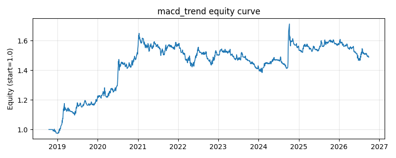

# 策略研究记录：macd_trend

> 类别/途径：**technical** ｜ 类型：timing ｜ 方向：只做多

## 一句话思路
MACD 动能：柱状图转正做多，明显转负离场（带缓冲）。

## 收集途径 / 灵感来源
经典技术分析——MACD。

## 核心假设
MACD 反映快慢动能差，柱持续为正代表上升动能占优。

## 参数
- `fast` = 12
- `slow` = 26
- `signal` = 9
- `band` = 0.0

## 实现要点
- 实现文件：`kairos_strategies/channels/technical.py`（类名对应本策略）。
- 输出统一为「目标权重面板」(date × asset)，由 `Backtester` 滞后一期执行，杜绝未来函数。
- 仅使用 numpy/pandas，离线、确定性。

## 数据与回测设置
| 项 | 值 |
|---|---|
| 数据集 | ashare_real（60 资产） |
| 区间 | 2018-10-16 ~ 2026-09-29 |
| 期数 | 1933 |
| 年化基准期数 | 252 |
| 单边成本率 | 0.1000% |
| 无风险利率 | 0.00% |

## 回测结果
| 指标 | 值 |
|---|---|
| 累计收益 | 48.95% |
| 年化收益 (CAGR) | 5.33% |
| 年化波动 | 9.20% |
| 夏普 | 0.6104 |
| 索提诺 | 0.9501 |
| 最大回撤 | 16.07% |
| 卡玛 | 0.3317 |
| 胜率 | 49.97% |
| 盈利因子 | 1.1291 |
| 平均换手 | 0.0819 |
| 累计换手 | 158.38 |

## 净值曲线

## 结论与改进方向
- 结果为 **真实历史数据（ashare_real）回测演示，存在过拟合/幸存者偏差/样本区间依赖等局限**，不构成任何投资建议或收益承诺。
- 改进方向：在真实数据上重跑、参数敏感性分析、加入波动率目标/风控叠加、与其它策略做相关性分散。
