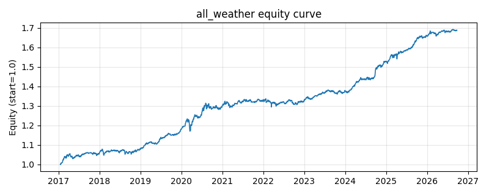

# 策略研究记录：all_weather

> 类别/途径：**multi_asset** ｜ 类型：cross_section ｜ 方向：只做多

## 一句话思路
全天候(类风险平价)：在风险资产类别间按逆波动分配，类别内等权。

## 收集途径 / 灵感来源
多资产配置——All Weather / 风险平价思想（类别层逆波动简化版）。

## 核心假设
低相关多资产 + 按风险而非资金配置，可在不同宏观环境下更稳健。

## 参数
- `window` = 60

## 实现要点
- 实现文件：`kairos_strategies/channels/multi_asset.py`（类名对应本策略）。
- 输出统一为「目标权重面板」(date × asset)，由 `Backtester` 滞后一期执行，杜绝未来函数。
- 仅使用 numpy/pandas，离线、确定性。

## 数据与回测设置
| 项 | 值 |
|---|---|
| 数据集 | ashare_etf_real（9 资产） |
| 区间 | 2017-01-18 ~ 2026-09-24 |
| 期数 | 2353 |
| 年化基准期数 | 252 |
| 单边成本率 | 0.0500% |
| 无风险利率 | 0.00% |

## 回测结果
| 指标 | 值 |
|---|---|
| 累计收益 | 68.76% |
| 年化收益 (CAGR) | 5.76% |
| 年化波动 | 3.40% |
| 夏普 | 1.6640 |
| 索提诺 | 2.4307 |
| 最大回撤 | 5.13% |
| 卡玛 | 1.1236 |
| 胜率 | 56.27% |
| 盈利因子 | 1.3485 |
| 平均换手 | 0.0094 |
| 累计换手 | 22.05 |

## 净值曲线

## 结论与改进方向
- 结果为 **真实历史数据（ashare_etf_real）回测演示，存在过拟合/幸存者偏差/样本区间依赖等局限**，不构成任何投资建议或收益承诺。
- 改进方向：在真实数据上重跑、参数敏感性分析、加入波动率目标/风控叠加、与其它策略做相关性分散。
