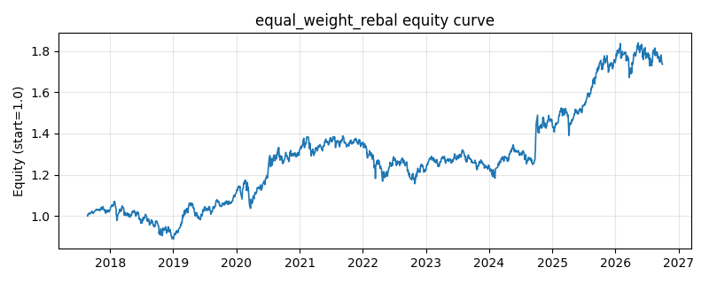

# 策略研究记录：equal_weight_rebal

> 类别/途径：**allocation** ｜ 类型：cross_section ｜ 方向：只做多

## 一句话思路
等权定期再平衡：每 k 期把组合调回 1/N 等权，其间买入持有让权重随收益自然漂移。

## 收集途径 / 灵感来源
组合配置经典范式——等权组合 + 日历再平衡 (calendar rebalancing)，原创 numpy 实现。

## 核心假设
等权是不预测收益的分散化基准；日历再平衡隐含『卖高买低』，在均值回归/震荡市中收割再平衡溢价并抑制权重漂移带来的集中度。在强者恒强的单边趋势市中，再平衡会过早减持赢家而跑输纯买入持有。

## 参数
- `rebal_freq` = 21

## 实现要点
- 实现文件：`kairos_strategies/channels/allocation.py`（类名对应本策略）。
- 输出统一为「目标权重面板」(date × asset)，由 `Backtester` 滞后一期执行，杜绝未来函数。
- 仅使用 numpy/pandas，离线、确定性。

## 数据与回测设置
| 项 | 值 |
|---|---|
| 数据集 | ashare_etf_real（14 资产） |
| 区间 | 2017-08-24 ~ 2026-09-30 |
| 期数 | 2210 |
| 年化基准期数 | 252 |
| 单边成本率 | 0.0500% |
| 无风险利率 | 0.00% |

## 回测结果
| 指标 | 值 |
|---|---|
| 累计收益 | 73.60% |
| 年化收益 (CAGR) | 6.49% |
| 年化波动 | 11.83% |
| 夏普 | 0.5912 |
| 索提诺 | 0.8282 |
| 最大回撤 | 16.99% |
| 卡玛 | 0.3820 |
| 胜率 | 52.90% |
| 盈利因子 | 1.1093 |
| 平均换手 | 0.0019 |
| 累计换手 | 4.25 |

## 净值曲线

## 结论与改进方向
- 结果为 **真实历史数据（ashare_etf_real）回测演示，存在过拟合/幸存者偏差/样本区间依赖等局限**，不构成任何投资建议或收益承诺。
- 改进方向：在真实数据上重跑、参数敏感性分析、加入波动率目标/风控叠加、与其它策略做相关性分散。
