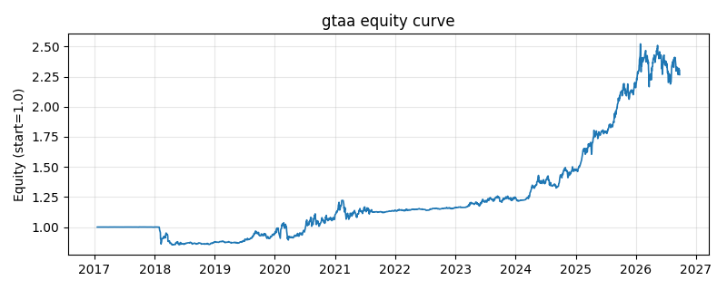

# 策略研究记录：gtaa

> 类别/途径：**multi_asset** ｜ 类型：cross_section ｜ 方向：只做多

## 一句话思路
全球战术资产配置：类别层 12 月绝对+相对动量选强，弱者转现金(货币ETF)。

## 收集途径 / 灵感来源
多资产配置——GTAA / 双动量(Antonacci)思想。

## 核心假设
资产类别存在中期动量；绝对动量过滤可在熊市 retreat 到现金降回撤。

## 参数
- `lookback` = 252
- `top_k` = 2
- `vol_window` = 60

## 实现要点
- 实现文件：`kairos_strategies/channels/multi_asset.py`（类名对应本策略）。
- 输出统一为「目标权重面板」(date × asset)，由 `Backtester` 滞后一期执行，杜绝未来函数。
- 仅使用 numpy/pandas，离线、确定性。

## 数据与回测设置
| 项 | 值 |
|---|---|
| 数据集 | ashare_etf_real（9 资产） |
| 区间 | 2017-01-18 ~ 2026-09-24 |
| 期数 | 2353 |
| 年化基准期数 | 252 |
| 单边成本率 | 0.0500% |
| 无风险利率 | 0.00% |

## 回测结果
| 指标 | 值 |
|---|---|
| 累计收益 | 126.64% |
| 年化收益 (CAGR) | 9.16% |
| 年化波动 | 12.68% |
| 夏普 | 0.7550 |
| 索提诺 | 1.0351 |
| 最大回撤 | 14.86% |
| 卡玛 | 0.6165 |
| 胜率 | 53.60% |
| 盈利因子 | 1.1784 |
| 平均换手 | 0.0904 |
| 累计换手 | 212.78 |

## 净值曲线

## 结论与改进方向
- 结果为 **真实历史数据（ashare_etf_real）回测演示，存在过拟合/幸存者偏差/样本区间依赖等局限**，不构成任何投资建议或收益承诺。
- 改进方向：在真实数据上重跑、参数敏感性分析、加入波动率目标/风控叠加、与其它策略做相关性分散。
