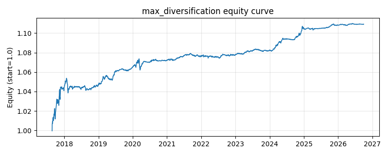

# 策略研究记录：max_diversification

> 类别/途径：**allocation** ｜ 类型：cross_section ｜ 方向：只做多

## 一句话思路
最大分散化：最大化分散化比率 DR=(Σwᵢσᵢ)/σ_p，自研两阶段迭代（阻尼定点迭代 + Frank-Wolfe 精确线搜索）求解，归一到每行和=1。

## 收集途径 / 灵感来源
组合配置经典范式——Most Diversified Portfolio（Choueifaty-Coignard 分散化比率思想），两阶段迭代求解为本仓库原创纯 numpy 实现。

## 核心假设
DR 度量『加权平均单资产波动』与『组合实际波动』之比，最大化 DR 即最大化分散化收益，避免组合被相关性结构中暗含的共同风险主导，兼具低相关暴露与风险均衡。当所有资产相关性趋同（系统性危机）时无处分散，DR 优势消失。

## 参数
- `window` = 60
- `max_iters` = 80
- `gamma` = 0.5
- `tol` = 1e-07
- `fw_iters` = 60
- `fw_tol` = 1e-09

## 实现要点
- 实现文件：`kairos_strategies/channels/allocation.py`（类名对应本策略）。
- 输出统一为「目标权重面板」(date × asset)，由 `Backtester` 滞后一期执行，杜绝未来函数。
- 仅使用 numpy/pandas，离线、确定性。

## 数据与回测设置
| 项 | 值 |
|---|---|
| 数据集 | ashare_etf_real（14 资产） |
| 区间 | 2017-08-24 ~ 2026-09-30 |
| 期数 | 2210 |
| 年化基准期数 | 252 |
| 单边成本率 | 0.0500% |
| 无风险利率 | 0.00% |

## 回测结果
| 指标 | 值 |
|---|---|
| 累计收益 | 10.92% |
| 年化收益 (CAGR) | 1.19% |
| 年化波动 | 0.96% |
| 夏普 | 1.2310 |
| 索提诺 | 2.0417 |
| 最大回撤 | 1.44% |
| 卡玛 | 0.8267 |
| 胜率 | 55.29% |
| 盈利因子 | 1.3924 |
| 平均换手 | 0.0278 |
| 累计换手 | 61.37 |

## 净值曲线

## 结论与改进方向
- 结果为 **真实历史数据（ashare_etf_real）回测演示，存在过拟合/幸存者偏差/样本区间依赖等局限**，不构成任何投资建议或收益承诺。
- 改进方向：在真实数据上重跑、参数敏感性分析、加入波动率目标/风控叠加、与其它策略做相关性分散。
