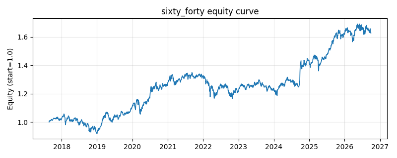

# 策略研究记录：sixty_forty

> 类别/途径：**multi_asset** ｜ 类型：cross_section ｜ 方向：只做多

## 一句话思路
经典 60/40：60% 股票(中外宽基等权) + 40% 债券，定期再平衡。

## 收集途径 / 灵感来源
多资产配置——传统 60/40 股债组合。

## 核心假设
股债负/低相关，60/40 是长期稳健的配置基准。

## 参数
- `equity` = 0.6

## 实现要点
- 实现文件：`kairos_strategies/channels/multi_asset.py`（类名对应本策略）。
- 输出统一为「目标权重面板」(date × asset)，由 `Backtester` 滞后一期执行，杜绝未来函数。
- 仅使用 numpy/pandas，离线、确定性。

## 数据与回测设置
| 项 | 值 |
|---|---|
| 数据集 | ashare_etf_real（14 资产） |
| 区间 | 2017-08-24 ~ 2026-09-30 |
| 期数 | 2210 |
| 年化基准期数 | 252 |
| 单边成本率 | 0.0500% |
| 无风险利率 | 0.00% |

## 回测结果
| 指标 | 值 |
|---|---|
| 累计收益 | 62.63% |
| 年化收益 (CAGR) | 5.70% |
| 年化波动 | 9.68% |
| 夏普 | 0.6215 |
| 索提诺 | 0.8743 |
| 最大回撤 | 13.70% |
| 卡玛 | 0.4162 |
| 胜率 | 52.67% |
| 盈利因子 | 1.1145 |
| 平均换手 | 0.0065 |
| 累计换手 | 14.45 |

## 净值曲线

## 结论与改进方向
- 结果为 **真实历史数据（ashare_etf_real）回测演示，存在过拟合/幸存者偏差/样本区间依赖等局限**，不构成任何投资建议或收益承诺。
- 改进方向：在真实数据上重跑、参数敏感性分析、加入波动率目标/风控叠加、与其它策略做相关性分散。
