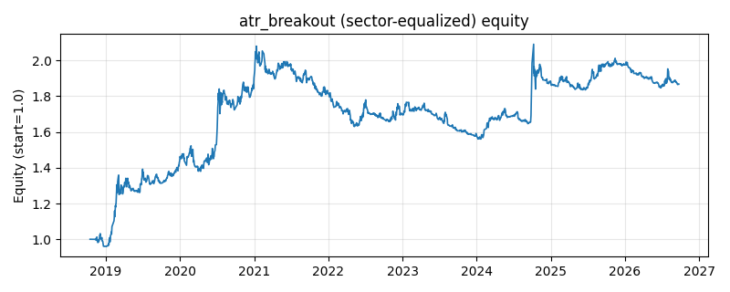

# 策略研究记录：atr_breakout

> 类别/途径：**volatility** ｜ 类型：timing+sector_equalize ｜ 方向：只做多

## 一句话思路
[行业均衡] ATR 通道突破：收盘价上穿「均线 + k×ATR」做多，跌回均线（或下轨）离场；状态机持有 + 通道滞后一期以降低换手。

## 收集途径 / 灵感来源
经典技术分析——ATR 通道 / 肯特纳通道 (Keltner channel) 突破范式（本仓库原创实现）。

## 核心假设
核心假设：以波动自适应的通道宽度能区分「真突破」与「噪声」——波动放大时门槛自动抬高，波动收敛后的突破更可能延续为趋势（波动收缩形态 VCP 的思路）。在趋势/突破行情中盈利，在无方向的宽幅震荡市中会被反复打脸（连续小亏，靠偶发大趋势回本）；由于用收盘价近似 TR（无日内高低点），通道偏窄，触发频率高于真实 ATR 通道。

## 参数
- `ma_window` = 20
- `atr_window` = 14
- `k` = 2.0
- `atr_floor_pct` = 0.002
- `exit_band` = 0.0
- `exit_ref` = mid

## 实现要点
- 实现文件：`kairos_strategies/channels/volatility.py`（类名对应本策略）。
- 输出统一为「目标权重面板」(date × asset)，由 `Backtester` 滞后一期执行，杜绝未来函数。
- 仅使用 numpy/pandas，离线、确定性。

## 数据与回测设置
| 项 | 值 |
|---|---|
| 数据集 | ashare_real（38 资产） |
| 区间 | 2018-10-16 ~ 2026-09-23 |
| 期数 | 1930 |
| 年化基准期数 | 252 |
| 单边成本率 | 0.1000% |
| 无风险利率 | 0.00% |

## 回测结果
| 指标 | 值 |
|---|---|
| 累计收益 | 86.77% |
| 年化收益 (CAGR) | 8.50% |
| 年化波动 | 12.99% |
| 夏普 | 0.6926 |
| 索提诺 | 1.0703 |
| 最大回撤 | 24.99% |
| 卡玛 | 0.3401 |
| 胜率 | 49.87% |
| 盈利因子 | 1.1633 |
| 平均换手 | 0.1019 |
| 累计换手 | 196.65 |

## 净值曲线

## 结论与改进方向
- 结果为 **真实历史数据（ashare_real）回测演示，存在过拟合/幸存者偏差/样本区间依赖等局限**，不构成任何投资建议或收益承诺。
- 改进方向：在真实数据上重跑、参数敏感性分析、加入波动率目标/风控叠加、与其它策略做相关性分散。
