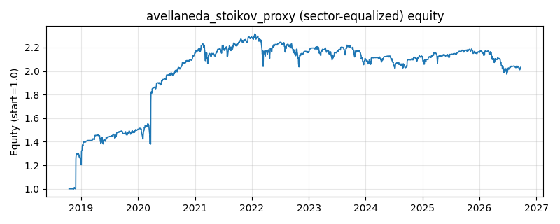

# 策略研究记录：avellaneda_stoikov_proxy

> 类别/途径：**market_making** ｜ 类型：timing+sector_equalize ｜ 方向：可多空

## 一句话思路
[行业均衡] A-S 做市日频代理：reservation price = 滚动 VWAP/均线参考价按 库存×gamma×日波动 调整，收盘价相对 reservation 的标准化偏离经 tanh 决定目标库存（价低建多、价高建空、偏离越大越反向），库存以 eta 速度向目标收敛并裁剪在 ±cap，权重=(库存/cap)×(1/N)；每行绝对值和 ≤ 1，行和可不为 0 但有界（净库存敞口）。

## 收集途径 / 灵感来源
Avellaneda-Stoikov (2008) 库存规避做市模型的日频概念性代理，本仓库原创 numpy 实现：reservation price 用滚动 VWAP/SMA + 库存×gamma×日波动调整，σ²(T−t) 以日波动率替代，非真实盘口撮合。与 meanrev.zscore_reversion（三态择时、无库存递推）、microstructure.vwap_reversion（只做多、无库存惩罚）、crypto.grid_trading（固定锚、long-only）在信号构造与组合形态上均不同。

## 核心假设
核心假设：短周期价格变动含流动性冲击成分，围绕公允锚（参考价）按偏离反向建立有界库存、并用库存惩罚项使净敞口均值回归，可在价格向参考价回归时获利（做市价差的日频代理）。失效场景：单边趋势/结构性位移中价格长期偏离参考价，库存被顶在上限「接飞刀」；日频数据无真实盘口，「成交」只是收盘价穿越的概念性近似，赚不到真实 bid-ask 价差，代理误差本身是主要模型风险。

## 参数
- `ref_window` = 20
- `sigma_window` = 20
- `gamma` = 1.0
- `eta` = 0.25
- `cap` = 5.0

## 实现要点
- 实现文件：`kairos_strategies/channels/market_making.py`（类名对应本策略）。
- 输出统一为「目标权重面板」(date × asset)，由 `Backtester` 滞后一期执行，杜绝未来函数。
- 仅使用 numpy/pandas，离线、确定性。

## 数据与回测设置
| 项 | 值 |
|---|---|
| 数据集 | ashare_real（38 资产） |
| 区间 | 2018-10-16 ~ 2026-09-23 |
| 期数 | 1930 |
| 年化基准期数 | 252 |
| 单边成本率 | 0.1000% |
| 无风险利率 | 0.00% |

## 回测结果
| 指标 | 值 |
|---|---|
| 累计收益 | 102.95% |
| 年化收益 (CAGR) | 9.68% |
| 年化波动 | 16.31% |
| 夏普 | 0.6405 |
| 索提诺 | 1.6459 |
| 最大回撤 | 14.84% |
| 卡玛 | 0.6525 |
| 胜率 | 49.15% |
| 盈利因子 | 1.2599 |
| 平均换手 | 0.0687 |
| 累计换手 | 132.64 |

## 净值曲线

## 结论与改进方向
- 结果为 **真实历史数据（ashare_real）回测演示，存在过拟合/幸存者偏差/样本区间依赖等局限**，不构成任何投资建议或收益承诺。
- 改进方向：在真实数据上重跑、参数敏感性分析、加入波动率目标/风控叠加、与其它策略做相关性分散。
