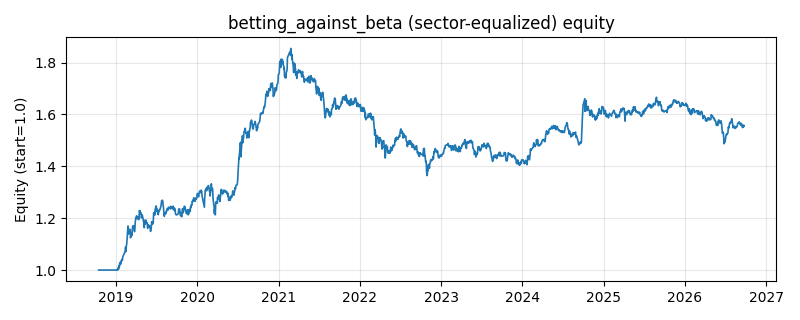

# 策略研究记录：betting_against_beta

> 类别/途径：**defensive** ｜ 类型：cross_section+sector_equalize ｜ 方向：可多空

## 一句话思路
[行业均衡] Betting-against-beta（自研版）：以等权组合为市场代理，逐资产滚动 OLS 估计 beta 并朝当期截面均值收缩；每期按 beta 升序取最低 leg_frac 分位为多头腿、最高 leg_frac 分位为空头腿（中间分位不下注），腿内权重 ∝ 1/clip(β) 后各自归一到 0.5 预算——逐行权重和 ≈ 0（美元中性）、绝对值之和 = 1（不加杠杆）；1/β 倾斜使腿内每个资产的 beta 贡献相等（w_i·β_i 恒定），而低 beta 腿的组合 beta 低于高 beta 腿，故美元中性下净 beta 为负——这正是 BAB 的防御属性。

## 收集途径 / 灵感来源
防御类范式——Betting Against Beta (Frazzini & Pedersen, 2014) 思路的本仓库原创实现：滚动 OLS beta + 截面收缩 + 三分位腿 + 1/β 腿内配权 + 美元中性归一，纯 numpy/pandas（不用 statsmodels）；与 regime 渠道 beta_timing（只做多的预算乘数再分配）、long_short 渠道 lowvol_ls（按波动率分位）在信号变量、配权规则与组合形态上均不同，所有工具函数在本模块内自实现。

## 核心假设
成因（杠杆约束异象）：受杠杆/融资约束的投资者无法用「借钱买低 beta」放大收益，只能退而买高 beta 资产来追求目标收益，于是高 beta 被系统性买贵、预期收益被压低，低 beta 反而提供更高的单位风险收益；加上高 beta 资产多为『彩票型』题材股、散户偏好与做空限制使其定价偏差更难被套利掉，做多做空两端即可赚到这条「beta 与预期收益负相关」的截面价差。用 1/β 配权而非等权，是让腿内每个资产承担相等的 beta 贡献，避免单只极端 beta 资产主导整条腿的市场风险，价差因此更接近纯 beta 异象。失效场景：强牛/流动性宽松阶段高 beta 暴力反弹，空头腿亏损超过多头腿盈利（BAB 的最大回撤来源，且空头对被逼空标的风险不封顶）；利率快速上行、风险偏好切换时防御风格整体跑输；beta 估计窗口与真实风险结构错配（急转弯处滞后一个窗口）；等权市场是粗糙的单因子代理，真实因子多元时残差仍被行业/风格共同因子污染；策略拥挤后价差被提前交易掉。

## 参数
- `beta_window` = 60
- `shrink` = 0.2
- `leg_frac` = 0.3333333333333333
- `leg_budget` = 0.5
- `beta_floor` = 0.1
- `beta_cap` = 4.0

## 实现要点
- 实现文件：`kairos_strategies/channels/defensive.py`（类名对应本策略）。
- 输出统一为「目标权重面板」(date × asset)，由 `Backtester` 滞后一期执行，杜绝未来函数。
- 仅使用 numpy/pandas，离线、确定性。

## 数据与回测设置
| 项 | 值 |
|---|---|
| 数据集 | ashare_real（38 资产） |
| 区间 | 2018-10-16 ~ 2026-09-23 |
| 期数 | 1930 |
| 年化基准期数 | 252 |
| 单边成本率 | 0.1000% |
| 无风险利率 | 0.00% |

## 回测结果
| 指标 | 值 |
|---|---|
| 累计收益 | 55.65% |
| 年化收益 (CAGR) | 5.95% |
| 年化波动 | 9.65% |
| 夏普 | 0.6470 |
| 索提诺 | 0.9478 |
| 最大回撤 | 26.44% |
| 卡玛 | 0.2249 |
| 胜率 | 51.36% |
| 盈利因子 | 1.1233 |
| 平均换手 | 0.0701 |
| 累计换手 | 135.22 |

## 净值曲线

## 结论与改进方向
- 结果为 **真实历史数据（ashare_real）回测演示，存在过拟合/幸存者偏差/样本区间依赖等局限**，不构成任何投资建议或收益承诺。
- 改进方向：在真实数据上重跑、参数敏感性分析、加入波动率目标/风控叠加、与其它策略做相关性分散。
