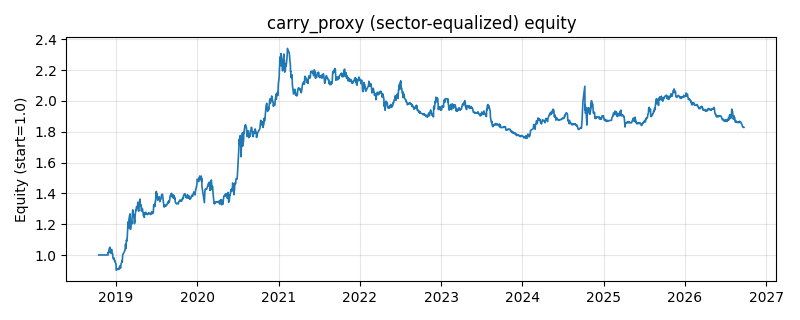

# 策略研究记录：carry_proxy

> 类别/途径：**crypto** ｜ 类型：timing+sector_equalize ｜ 方向：只做多

## 一句话思路
[行业均衡] carry 代理：以「短期均线 - 长期均线」的相对价差作为持有收益 (carry) 的概念性代理，正 carry（短均线高于长均线）时持有、否则空仓，等预算 1/N。

## 收集途径 / 灵感来源
加密市场实践——资金费率/现货-远期 carry 的概念性代理，本仓库基于价格面板原创实现。

## 核心假设
真实的现货-远期基差/资金费在加密市场代表持有收益；此处用价格面板的短长均线价差做概念性代理——正价差近似『持有有正收益』。注意这是概念性代理、非真实资金费数据；震荡市中价差频繁变号会失效。

## 参数
- `fast` = 10
- `slow` = 30
- `buffer` = 0.0

## 实现要点
- 实现文件：`kairos_strategies/channels/crypto.py`（类名对应本策略）。
- 输出统一为「目标权重面板」(date × asset)，由 `Backtester` 滞后一期执行，杜绝未来函数。
- 仅使用 numpy/pandas，离线、确定性。

## 数据与回测设置
| 项 | 值 |
|---|---|
| 数据集 | ashare_real（38 资产） |
| 区间 | 2018-10-16 ~ 2026-09-23 |
| 期数 | 1930 |
| 年化基准期数 | 252 |
| 单边成本率 | 0.1000% |
| 无风险利率 | 0.00% |

## 回测结果
| 指标 | 值 |
|---|---|
| 累计收益 | 82.88% |
| 年化收益 (CAGR) | 8.20% |
| 年化波动 | 14.88% |
| 夏普 | 0.6042 |
| 索提诺 | 0.8840 |
| 最大回撤 | 24.93% |
| 卡玛 | 0.3290 |
| 胜率 | 49.76% |
| 盈利因子 | 1.1308 |
| 平均换手 | 0.0855 |
| 累计换手 | 164.92 |

## 净值曲线

## 结论与改进方向
- 结果为 **真实历史数据（ashare_real）回测演示，存在过拟合/幸存者偏差/样本区间依赖等局限**，不构成任何投资建议或收益承诺。
- 改进方向：在真实数据上重跑、参数敏感性分析、加入波动率目标/风控叠加、与其它策略做相关性分散。
