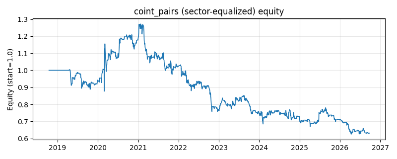

# 策略研究记录：coint_pairs

> 类别/途径：**statarb** ｜ 类型：cross_section+sector_equalize ｜ 方向：可多空

## 一句话思路
[行业均衡] 协整配对统计套利：在滚动网格上遍历全部资产对，用 OLS 做 Engle-Granger 第一步估对冲比率 β，第二步对残差跑自研 ADF 回归（Δe=c+λe₋₁）得到 t 统计量与半衰期，在通过门槛的对里挑「价差最紧(R² 最高)、协整证据最强」的一对；再对残差 logy-α-β·logx 做滚动 z-score，价差被高估(z 高)做空价差、被低估(z 低)做多价差，两腿等预算反向，组合逐行权重和恒为 0。

## 收集途径 / 灵感来源
统计套利经典范式——Engle-Granger 协整配对交易（cointegrated pairs trading）。OLS 对冲比率、ADF 风格 t 统计量、半衰期与配对排序均为本仓库原创 numpy 实现，不依赖 statsmodels（也不查 Dickey-Fuller 临界值表）；与 meanrev 渠道的 pairs_spread（固定两腿、β=1 的对数价差）不同，此处配对是自动筛选的且带估出的 β。

## 核心假设
核心假设：存在协整关系的资产对，其线性组合（相对估值）是平稳的，偏离中枢后由套利/基本面纽带拉回，故残差 z-score 的反向持仓期望为正，且多空对冲剥离了市场 beta。失效场景：协整关系结构性破裂（并购、行业政策、基本面脱钩）时残差不回归而持续发散，亏损无自然上限；ADF/半衰期只刻画历史平稳性，且小样本下伪回归会让残差看起来均值回归，故仍可能选中并不真协整的对。

## 参数
- `est_window` = 120
- `z_window` = 40
- `select_freq` = 20
- `entry_z` = 1.5
- `exit_z` = 0.5
- `leg_budget` = 0.5
- `max_half_life` = 60.0
- `min_adf_t` = -2.0

## 实现要点
- 实现文件：`kairos_strategies/channels/statarb.py`（类名对应本策略）。
- 输出统一为「目标权重面板」(date × asset)，由 `Backtester` 滞后一期执行，杜绝未来函数。
- 仅使用 numpy/pandas，离线、确定性。

## 数据与回测设置
| 项 | 值 |
|---|---|
| 数据集 | ashare_real（38 资产） |
| 区间 | 2018-10-16 ~ 2026-09-23 |
| 期数 | 1930 |
| 年化基准期数 | 252 |
| 单边成本率 | 0.1000% |
| 无风险利率 | 0.00% |

## 回测结果
| 指标 | 值 |
|---|---|
| 累计收益 | -36.96% |
| 年化收益 (CAGR) | -5.85% |
| 年化波动 | 16.15% |
| 夏普 | -0.2946 |
| 索提诺 | -0.4621 |
| 最大回撤 | 50.89% |
| 卡玛 | -0.1149 |
| 胜率 | 41.17% |
| 盈利因子 | 0.9224 |
| 平均换手 | 0.0985 |
| 累计换手 | 190.18 |

## 净值曲线

## 结论与改进方向
- 结果为 **真实历史数据（ashare_real）回测演示，存在过拟合/幸存者偏差/样本区间依赖等局限**，不构成任何投资建议或收益承诺。
- 改进方向：在真实数据上重跑、参数敏感性分析、加入波动率目标/风控叠加、与其它策略做相关性分散。
