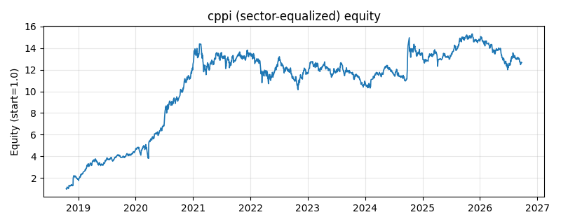

# 策略研究记录：cppi

> 类别/途径：**riskmgmt** ｜ 类型：overlay+sector_equalize ｜ 方向：只做多

## 一句话思路
[行业均衡] 固定比例组合保险 (CPPI)：以等权组合为风险资产、现金为保本资产，递推模拟受保护净值 V（起点 1，现金收益 0），每期敞口 e = min(1, multiplier × (V - floor) / V)，剩余 1-e 配现金；V 跌破 floor 后敞口永久归零（吸收态），实现『最差亏到 floor 附近』的保底语义。

## 收集途径 / 灵感来源
经典结构化产品范式——Constant Proportion Portfolio Insurance (Black-Perold / Black-Jones 的 CPPI)，此处为等权组合层的原创递推实现（策略自身净值状态机）。

## 核心假设
核心假设：凸性保护（convex protection）——仓位随安全垫 (V-floor) 线性缩放，让组合在接近保底线时自动去风险，理论上把最大回撤锁定在 1-floor 附近，代价是『踏空风险』：崩盘后即便市场 V 型反转，策略也已锁定空仓无法参与（吸收态设计），且缺口 (gap) 行情下实际净值可能击穿 floor（单期跌幅超过 1/multiplier 时安全垫直接转负）。multiplier 越大越接近满仓持有、保护越弱；越小越保守、越容易永久出局。适合有明确保底线需求的下行保护场景，不适合追求反弹收益的场景。

## 参数
- `floor` = 0.8
- `multiplier` = 5.0

## 实现要点
- 实现文件：`kairos_strategies/channels/riskmgmt.py`（类名对应本策略）。
- 输出统一为「目标权重面板」(date × asset)，由 `Backtester` 滞后一期执行，杜绝未来函数。
- 仅使用 numpy/pandas，离线、确定性。

## 数据与回测设置
| 项 | 值 |
|---|---|
| 数据集 | ashare_real（38 资产） |
| 区间 | 2018-10-16 ~ 2026-09-23 |
| 期数 | 1930 |
| 年化基准期数 | 252 |
| 单边成本率 | 0.1000% |
| 无风险利率 | 0.00% |

## 回测结果
| 指标 | 值 |
|---|---|
| 累计收益 | 1165.53% |
| 年化收益 (CAGR) | 39.29% |
| 年化波动 | 34.08% |
| 夏普 | 1.1281 |
| 索提诺 | 2.2842 |
| 最大回撤 | 29.47% |
| 卡玛 | 1.3334 |
| 胜率 | 50.67% |
| 盈利因子 | 1.3023 |
| 平均换手 | 0.0175 |
| 累计换手 | 33.70 |

## 净值曲线

## 结论与改进方向
- 结果为 **真实历史数据（ashare_real）回测演示，存在过拟合/幸存者偏差/样本区间依赖等局限**，不构成任何投资建议或收益承诺。
- 改进方向：在真实数据上重跑、参数敏感性分析、加入波动率目标/风控叠加、与其它策略做相关性分散。
