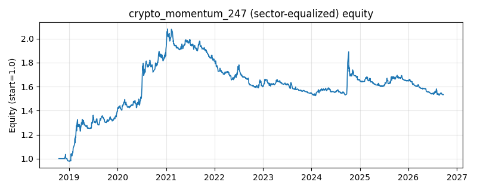

# 策略研究记录：crypto_momentum_247

> 类别/途径：**crypto** ｜ 类型：timing+sector_equalize ｜ 方向：只做多

## 一句话思路
[行业均衡] 24/7 动量：加密市场无休市，用较短窗口（7/30 期）时序动量双确认，做多强势币、空仓弱势币，等预算 1/N。

## 收集途径 / 灵感来源
加密市场实践——24/7 短周期时序动量，本仓库基于价格面板原创实现。

## 核心假设
加密资产 7x24 连续交易、信息消化更快，趋势窗口更短，短周期动量在趋势延续段有效；高噪声震荡期频繁进出会失效。

## 参数
- `fast` = 7
- `slow` = 30

## 实现要点
- 实现文件：`kairos_strategies/channels/crypto.py`（类名对应本策略）。
- 输出统一为「目标权重面板」(date × asset)，由 `Backtester` 滞后一期执行，杜绝未来函数。
- 仅使用 numpy/pandas，离线、确定性。

## 数据与回测设置
| 项 | 值 |
|---|---|
| 数据集 | ashare_real（38 资产） |
| 区间 | 2018-10-16 ~ 2026-09-23 |
| 期数 | 1930 |
| 年化基准期数 | 252 |
| 单边成本率 | 0.1000% |
| 无风险利率 | 0.00% |

## 回测结果
| 指标 | 值 |
|---|---|
| 累计收益 | 53.33% |
| 年化收益 (CAGR) | 5.74% |
| 年化波动 | 11.22% |
| 夏普 | 0.5532 |
| 索提诺 | 0.8831 |
| 最大回撤 | 26.75% |
| 卡玛 | 0.2146 |
| 胜率 | 49.18% |
| 盈利因子 | 1.1333 |
| 平均换手 | 0.1821 |
| 累计换手 | 351.47 |

## 净值曲线

## 结论与改进方向
- 结果为 **真实历史数据（ashare_real）回测演示，存在过拟合/幸存者偏差/样本区间依赖等局限**，不构成任何投资建议或收益承诺。
- 改进方向：在真实数据上重跑、参数敏感性分析、加入波动率目标/风控叠加、与其它策略做相关性分散。
