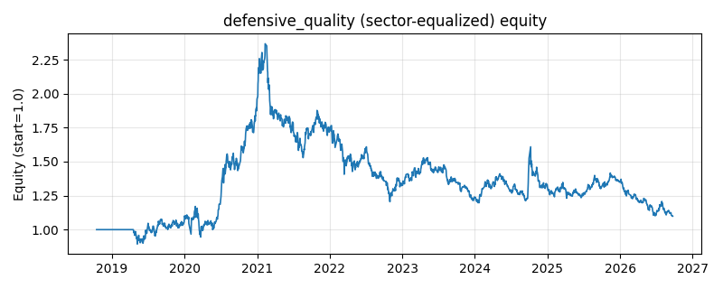

# 策略研究记录：defensive_quality

> 类别/途径：**defensive** ｜ 类型：cross_section+sector_equalize ｜ 方向：只做多

## 一句话思路
[行业均衡] 防御质量复合（只做多满仓）：三个纯价格成分先各自截面标准化再合成——(1) 低波动：−已实现波动（vol_window）；(2) 浅回撤：−当期回撤深度（1 − p/滚动 dd_window 期高点）；(3) 正长期趋势：p/慢均线(ma_window) − 1（在慢均线之上为正，裁剪到 ±trend_clip 抑制离群）；合成分 = w_vol·z₁ + w_dd·z₂ + w_trend·z₃，按**排名线性**配权做多得分最高的 top_frac 一篮子（第 j 名权重 ∝ k+1−j），逐行归一到和 = 1；任一成分未知的资产当日不选，预热期整行空仓。

## 收集途径 / 灵感来源
防御类范式——『低波动 + 浅回撤 + 长期趋势』复合质量打分的本仓库原创实现（纯价格构造，不臆造基本面/盈利质量数据）；与 long_short 渠道 quality_ls（价格效率 + 低波动、两端下注）、factor 渠道 low_volatility（波动单因子）在成分、配权规则（排名线性）与组合形态（只做多满仓）上均不同。

## 核心假设
成因：三个成分刻画同一类『防御质量』资产的不同侧面——低波动对应彩票偏好与杠杆约束导致的高波资产被高估；浅回撤说明价格仍被资金承接、下行弹性小（贴近自身高点的资产抛压已消化）；站上慢均线说明长期趋势为正、不是在下跌途中『看似安全』。三者合成能过滤单因子的假信号：低波但深回撤者（阴跌的类债券资产）会被回撤与趋势成分否掉，趋势向上但剧烈震荡者会被波动成分否掉，剩下的是『又稳又贴近高点又在长期上升通道』的一篮子，长期回撤更小、夏普更高。用截面 z 合成保证量纲统一、互不淹没，用排名线性配权保证对离群值稳健。失效场景：三成分高度相关（危机中一起恶化），合成退化为单因子、区分度骤降；风格急切换/深 V 反弹时深回撤资产弹性最大，防御篮子踏空；趋势成分在拐点处滞后（均线之上但已见顶）；成分权重是主观先验，相关性结构变化会让某一维主导；防御篮子拥挤后估值溢价被提前交易掉。

## 参数
- `vol_window` = 21
- `dd_window` = 63
- `ma_window` = 126
- `trend_clip` = 0.3
- `w_vol` = 0.4
- `w_dd` = 0.35
- `w_trend` = 0.25
- `top_frac` = 0.3333333333333333

## 实现要点
- 实现文件：`kairos_strategies/channels/defensive.py`（类名对应本策略）。
- 输出统一为「目标权重面板」(date × asset)，由 `Backtester` 滞后一期执行，杜绝未来函数。
- 仅使用 numpy/pandas，离线、确定性。

## 数据与回测设置
| 项 | 值 |
|---|---|
| 数据集 | ashare_real（38 资产） |
| 区间 | 2018-10-16 ~ 2026-09-23 |
| 期数 | 1930 |
| 年化基准期数 | 252 |
| 单边成本率 | 0.1000% |
| 无风险利率 | 0.00% |

## 回测结果
| 指标 | 值 |
|---|---|
| 累计收益 | 9.88% |
| 年化收益 (CAGR) | 1.24% |
| 年化波动 | 20.94% |
| 夏普 | 0.1635 |
| 索提诺 | 0.2335 |
| 最大回撤 | 53.58% |
| 卡玛 | 0.0231 |
| 胜率 | 50.25% |
| 盈利因子 | 1.0305 |
| 平均换手 | 0.2977 |
| 累计换手 | 574.50 |

## 净值曲线

## 结论与改进方向
- 结果为 **真实历史数据（ashare_real）回测演示，存在过拟合/幸存者偏差/样本区间依赖等局限**，不构成任何投资建议或收益承诺。
- 改进方向：在真实数据上重跑、参数敏感性分析、加入波动率目标/风控叠加、与其它策略做相关性分散。
