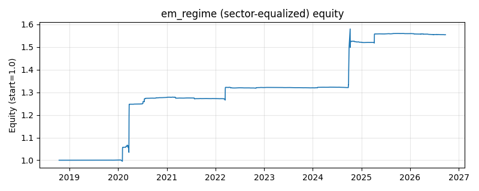

# 策略研究记录：em_regime

> 类别/途径：**regime** ｜ 类型：overlay+sector_equalize ｜ 方向：只做多

## 一句话思路
[行业均衡] 自研 2 状态高斯 EM 择时：对等权组合收益用 2 分量一维高斯混合 EM（numpy 自研、中位数分割确定性初始化、无随机数）做 walk-forward 拟合——每 refit 期只用截至当期的历史收益重拟合一次，均值较高的分量判为 bull；当期总敞口 = 当期收益属于 bull 分量的后验概率线性映射到 [bear_expo, bull_expo]，两次 refit 之间参数冻结、仅在线打分（bull 满仓、bear 空仓/降杠杆，每资产敞口/N）。

## 收集途径 / 灵感来源
Hamilton(1989) 马尔可夫状态切换思想的『2 分量高斯混合 EM + walk-forward』简化实现；EM 算法、确定性初始化、log 域责任计算与冻结参数在线打分均为本仓库原创，未引入任何第三方 ML 库。

## 核心假设
核心假设：市场收益是 bull/bear 两种状态的高斯混合（Hamilton regime switching 的简化），EM 后验概率是比硬阈值更平滑的『状态置信度』——bear 证据逐步累积时仓位连续下降，避免开关式择时在临界点反复抖动；walk-forward 重拟合保证状态参数跟随分布漂移且严格无未来。失效场景：单一状态市场被强行二分（后验在 0.5 附近漂移，仓位中庸无增益）、状态突变（下次 refit 前参数冻结，识别滞后最多 refit 期）、以及厚尾/非高斯收益使高斯分量误判极端事件为状态切换。

## 参数
- `min_train` = 250
- `refit` = 21
- `n_iter` = 60
- `tol` = 1e-07
- `bull_expo` = 1.0
- `bear_expo` = 0.0

## 实现要点
- 实现文件：`kairos_strategies/channels/regime.py`（类名对应本策略）。
- 输出统一为「目标权重面板」(date × asset)，由 `Backtester` 滞后一期执行，杜绝未来函数。
- 仅使用 numpy/pandas，离线、确定性。

## 数据与回测设置
| 项 | 值 |
|---|---|
| 数据集 | ashare_real（38 资产） |
| 区间 | 2018-10-16 ~ 2026-09-23 |
| 期数 | 1930 |
| 年化基准期数 | 252 |
| 单边成本率 | 0.1000% |
| 无风险利率 | 0.00% |

## 回测结果
| 指标 | 值 |
|---|---|
| 累计收益 | 55.42% |
| 年化收益 (CAGR) | 5.93% |
| 年化波动 | 7.65% |
| 夏普 | 0.7891 |
| 索提诺 | 2.8907 |
| 最大回撤 | 5.17% |
| 卡玛 | 1.1475 |
| 胜率 | 49.23% |
| 盈利因子 | 3.8371 |
| 平均换手 | 0.0125 |
| 累计换手 | 24.13 |

## 净值曲线

## 结论与改进方向
- 结果为 **真实历史数据（ashare_real）回测演示，存在过拟合/幸存者偏差/样本区间依赖等局限**，不构成任何投资建议或收益承诺。
- 改进方向：在真实数据上重跑、参数敏感性分析、加入波动率目标/风控叠加、与其它策略做相关性分散。
