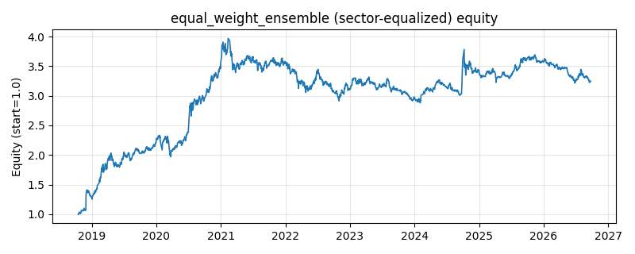

# 策略研究记录：equal_weight_ensemble

> 类别/途径：**ensemble** ｜ 类型：cross_section+sector_equalize ｜ 方向：只做多

## 一句话思路
[行业均衡] 等权元策略：把 sma_cross、donchian_turtle、ts_momentum、low_volatility、inverse_vol 五个基础策略的目标权重面板按 1/5 等权平均成单一元策略权重（各腿先统一为 long_only，系数恒为 1/5，每行权重和 ≤ 1，无杠杆）。

## 收集途径 / 灵感来源
元策略（strategy of strategies / fund-of-strategies）经典范式——策略层等权组合；基础策略全部复用本仓库 technical / momentum / factor / allocation 渠道已稳定的公开 Strategy 类，等权混合、long_only 统一与去杠杆为本渠道原创实现。

## 核心假设
核心假设：单个策略的失效时点无法预测，而趋势择时（双均线/通道突破）、时序动量、低波动异象、逆波动率配置这几类范式的收益驱动来源不同、相关性较低，等权平均能在不做任何『哪个策略接下来有效』判断的前提下分散策略层风险，压低元策略波动与单策略回撤，长期获得更接近池内平均、更平滑的净值。失效场景：系统性危机中各基础策略暴露趋同（趋势与低波同时受挫、相关性趋向 1），分散化红利消失；等权也放弃了对表现差异的自适应，长期会跑输池内最优单策略，且在全部基础策略同向亏损时同样亏损。

## 参数
- `weighting` = equal
- `n_bases` = 5
- `bases` = ['sma_cross', 'donchian_turtle', 'ts_momentum', 'low_volatility', 'inverse_vol']

## 实现要点
- 实现文件：`kairos_strategies/channels/ensemble.py`（类名对应本策略）。
- 输出统一为「目标权重面板」(date × asset)，由 `Backtester` 滞后一期执行，杜绝未来函数。
- 仅使用 numpy/pandas，离线、确定性。

## 数据与回测设置
| 项 | 值 |
|---|---|
| 数据集 | ashare_real（38 资产） |
| 区间 | 2018-10-16 ~ 2026-09-23 |
| 期数 | 1930 |
| 年化基准期数 | 252 |
| 单边成本率 | 0.1000% |
| 无风险利率 | 0.00% |

## 回测结果
| 指标 | 值 |
|---|---|
| 累计收益 | 224.63% |
| 年化收益 (CAGR) | 16.62% |
| 年化波动 | 18.28% |
| 夏普 | 0.9304 |
| 索提诺 | 1.5482 |
| 最大回撤 | 27.42% |
| 卡玛 | 0.6061 |
| 胜率 | 50.26% |
| 盈利因子 | 1.2111 |
| 平均换手 | 0.0677 |
| 累计换手 | 130.71 |

## 净值曲线

## 结论与改进方向
- 结果为 **真实历史数据（ashare_real）回测演示，存在过拟合/幸存者偏差/样本区间依赖等局限**，不构成任何投资建议或收益承诺。
- 改进方向：在真实数据上重跑、参数敏感性分析、加入波动率目标/风控叠加、与其它策略做相关性分散。
