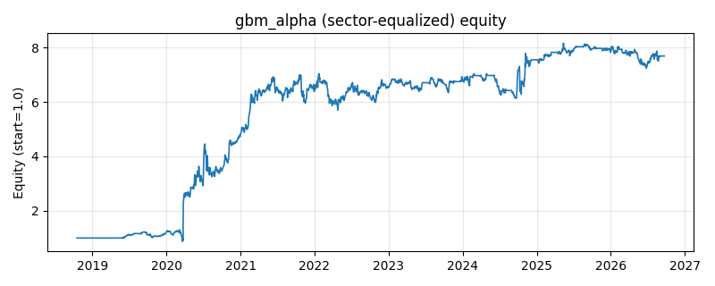

# 策略研究记录：gbm_alpha

> 类别/途径：**ml_signal** ｜ 类型：cross_section+sector_equalize ｜ 方向：可多空

## 一句话思路
[行业均衡] 自研梯度提升决策桩集成 walk-forward 预测下期收益：扩展窗口每 21 期重训，逐轮拟合残差（分位数分箱 + 全量阈值搜索，确定性），按预测值截面去均值后做多高分/做空低分（美元中性，绝对值和 = 1），权重持有到下次重训。

## 收集途径 / 灵感来源
机器学习范式——梯度提升树（Friedman GBM，决策桩为基学习器），分箱、分裂搜索与提升循环纯 numpy 自研，不使用任何第三方 ML 库。

## 核心假设
提升法把大量弱学习器（单特征阈值分裂）叠加，可捕捉线性模型漏掉的单调非线性与阈值效应（如 RSI 超买超卖、动量突破）；小学习率 + 有限轮数 + 分箱即天然正则。金融序列信噪比低，轮数/箱数过大易过拟合噪声；市场结构突变时历史分裂点失效。

## 参数
- `n_estimators` = 60
- `learning_rate` = 0.08
- `n_bins` = 32
- `refit` = 21
- `train_window` = None
- `min_train_dates` = 126
- `budget` = 1.0

## 实现要点
- 实现文件：`kairos_strategies/channels/ml_signal.py`（类名对应本策略）。
- 输出统一为「目标权重面板」(date × asset)，由 `Backtester` 滞后一期执行，杜绝未来函数。
- 仅使用 numpy/pandas，离线、确定性。

## 数据与回测设置
| 项 | 值 |
|---|---|
| 数据集 | ashare_real（38 资产） |
| 区间 | 2018-10-16 ~ 2026-09-23 |
| 期数 | 1930 |
| 年化基准期数 | 252 |
| 单边成本率 | 0.1000% |
| 无风险利率 | 0.00% |

## 回测结果
| 指标 | 值 |
|---|---|
| 累计收益 | 668.68% |
| 年化收益 (CAGR) | 30.51% |
| 年化波动 | 59.37% |
| 夏普 | 0.6301 |
| 索提诺 | 2.2967 |
| 最大回撤 | 33.18% |
| 卡玛 | 0.9196 |
| 胜率 | 50.13% |
| 盈利因子 | 1.3821 |
| 平均换手 | 0.0418 |
| 累计换手 | 80.59 |

## 净值曲线

## 结论与改进方向
- 结果为 **真实历史数据（ashare_real）回测演示，存在过拟合/幸存者偏差/样本区间依赖等局限**，不构成任何投资建议或收益承诺。
- 改进方向：在真实数据上重跑、参数敏感性分析、加入波动率目标/风控叠加、与其它策略做相关性分散。
