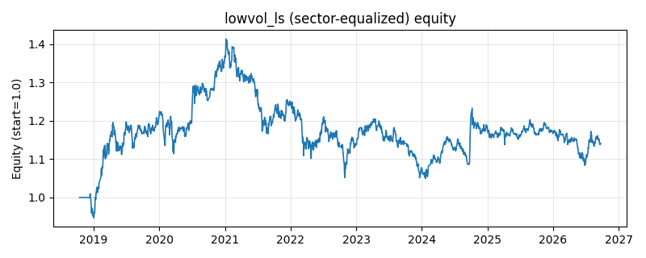

# 策略研究记录：lowvol_ls

> 类别/途径：**long_short** ｜ 类型：cross_section+sector_equalize ｜ 方向：可多空

## 一句话思路
[行业均衡] 低波动多空：按尾部窗口已实现波动率截面排序，做多波动最低的 top 分位一篮子、做空波动最高的 bottom 分位一篮子（分数 = -波动率），两腿等权各占 0.5 预算，组合美元中性，是低波异象的市场中性版本。

## 收集途径 / 灵感来源
多空股票 alpha 经典范式——低波动异象 (low-volatility anomaly, Ang-Hodges 思路) 的市场中性版本，本仓库原创实现；与 factor 渠道的 low_volatility（只做多低波篮子）、statarb 渠道的 basket_neutral（用波动分篮后交易篮子便宜度价差）不同，此处直接按波动分位两端下注，波动率工具函数在本模块内自实现。

## 核心假设
成因：彩票偏好使散户系统性高估「博收益」的高波动资产（愿意为其支付溢价），机构又因杠杆/基准约束偏好高 beta 替代加杠杆，两头挤压之下高波资产预期收益反而更低；同时做空高波、做多低波能把这个异象的两端价差都拿到手，且对冲掉市场方向后，剩余暴露主要是「波动率溢价」这一维。失效条件：低波篮子拥挤、估值被买贵后异象衰减；危机后修复期与流动性宽松期高 beta 资产暴力反弹，空头腿亏损可能远超多头腿盈利（低波多空的最大回撤来源）；利率快速上行时低波资产（类债券久期属性）跑输；低波篮子集中于防御性行业，行业轮动会造成阶段性风格回撤。

## 参数
- `vol_window` = 42
- `top_frac` = 0.3333333333333333
- `leg_budget` = 0.5

## 实现要点
- 实现文件：`kairos_strategies/channels/long_short.py`（类名对应本策略）。
- 输出统一为「目标权重面板」(date × asset)，由 `Backtester` 滞后一期执行，杜绝未来函数。
- 仅使用 numpy/pandas，离线、确定性。

## 数据与回测设置
| 项 | 值 |
|---|---|
| 数据集 | ashare_real（38 资产） |
| 区间 | 2018-10-16 ~ 2026-09-23 |
| 期数 | 1930 |
| 年化基准期数 | 252 |
| 单边成本率 | 0.1000% |
| 无风险利率 | 0.00% |

## 回测结果
| 指标 | 值 |
|---|---|
| 累计收益 | 14.04% |
| 年化收益 (CAGR) | 1.73% |
| 年化波动 | 10.10% |
| 夏普 | 0.2204 |
| 索提诺 | 0.3171 |
| 最大回撤 | 25.72% |
| 卡玛 | 0.0673 |
| 胜率 | 49.34% |
| 盈利因子 | 1.0403 |
| 平均换手 | 0.0805 |
| 累计换手 | 155.29 |

## 净值曲线

## 结论与改进方向
- 结果为 **真实历史数据（ashare_real）回测演示，存在过拟合/幸存者偏差/样本区间依赖等局限**，不构成任何投资建议或收益承诺。
- 改进方向：在真实数据上重跑、参数敏感性分析、加入波动率目标/风控叠加、与其它策略做相关性分散。
