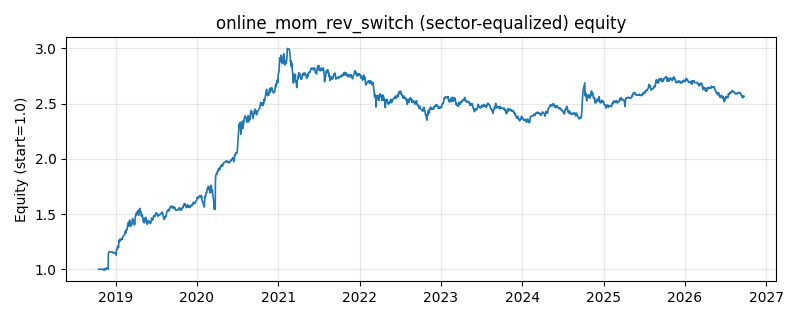

# 策略研究记录：online_mom_rev_switch

> 类别/途径：**adaptive** ｜ 类型：cross_section+sector_equalize ｜ 方向：只做多

## 一句话思路
[行业均衡] 在线动量/均值回归切换元策略：并行跟踪动量专家 ts_momentum 与均值回归专家 rsi_reversion 的零成本回测奖励，第 t 期用「截至 t-1」的 window 期奖励差均值/标准差得到相对优势 z 值，倾斜量 tilt = tilt_max·z/(1+|z|)，按 (0.5+tilt, 0.5-tilt) 在线混合两腿权重面板；预热期或优势不明时回退中性 50/50。

## 收集途径 / 灵感来源
在线学习范式——专家跟踪 (expert tracking) / 在线 regime 切换的自研实现：对两个对立风格专家维护滚动相对优势统计量并做有界软倾斜；两腿分别复用本仓库 momentum.TsMomentumStrategy 与 technical.RsiReversionStrategy 公开类，奖励由 engine.Backtester 回测产生。

## 核心假设
核心假设：市场在『趋势 regime』与『震荡 regime』之间交替——动量专家在单边行情赚趋势钱、在震荡市被反复止损；均值回归专家恰好相反。两类奖励的滚动相对优势是 regime 的可观测代理，把权重连续地偏向近期更优的一类可让元策略净值自适应两种行情（在线的风格轮动）。有界软倾斜 z/(1+|z|) 保证任一腿权重不低于 0.5-tilt_max：即使判断错误也保留另一腿的纠错仓位，避免硬切换的双倍打脸。防未来：滚动均值/标准差算完后整体 shift(1)，第 t 期系数严格只用 ≤t-1 的已实现奖励差。失效场景：regime 快速交替（窗口内两种行情各半）时 z 值在 0 附近抖动、切换滞后于 regime 本身；两腿表现高度相关时相对优势不含信息，退化为近似 50/50。

## 参数
- `window` = 42
- `tilt_max` = 0.35
- `std_floor` = 0.0001
- `momentum_leg` = ts_momentum
- `reversion_leg` = rsi_reversion
- `cost_rate` = 0.0

## 实现要点
- 实现文件：`kairos_strategies/channels/adaptive.py`（类名对应本策略）。
- 输出统一为「目标权重面板」(date × asset)，由 `Backtester` 滞后一期执行，杜绝未来函数。
- 仅使用 numpy/pandas，离线、确定性。

## 数据与回测设置
| 项 | 值 |
|---|---|
| 数据集 | ashare_real（38 资产） |
| 区间 | 2018-10-16 ~ 2026-09-23 |
| 期数 | 1930 |
| 年化基准期数 | 252 |
| 单边成本率 | 0.1000% |
| 无风险利率 | 0.00% |

## 回测结果
| 指标 | 值 |
|---|---|
| 累计收益 | 156.72% |
| 年化收益 (CAGR) | 13.10% |
| 年化波动 | 13.57% |
| 夏普 | 0.9734 |
| 索提诺 | 1.7682 |
| 最大回撤 | 22.44% |
| 卡玛 | 0.5837 |
| 胜率 | 50.78% |
| 盈利因子 | 1.2472 |
| 平均换手 | 0.0694 |
| 累计换手 | 133.97 |

## 净值曲线

## 结论与改进方向
- 结果为 **真实历史数据（ashare_real）回测演示，存在过拟合/幸存者偏差/样本区间依赖等局限**，不构成任何投资建议或收益承诺。
- 改进方向：在真实数据上重跑、参数敏感性分析、加入波动率目标/风控叠加、与其它策略做相关性分散。
