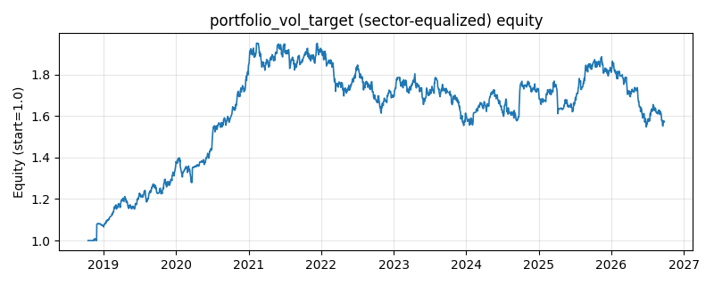

# 策略研究记录：portfolio_vol_target

> 类别/途径：**riskmgmt** ｜ 类型：overlay+sector_equalize ｜ 方向：只做多

## 一句话思路
[行业均衡] 组合波动目标 overlay：对『等权 1/N 基准组合』本身做风险预算——用 EWMA（RiskMetrics 风格，平方收益指数平滑）估计基准组合的年化已实现波动，总敞口 e = clip(target_vol / 已实现波动, 0, 1)，每资产 e/N，余额留现金；波动未知的预热期不建仓。

## 收集途径 / 灵感来源
风险管理范式——volatility targeting / RiskMetrics EWMA 波动估计在等权基准组合层的原创实现（与本仓库 vol_target、vol_target_taa 在作用对象与估计方法上均不同）。

## 核心假设
核心假设：波动率聚集且可预测（EWMA 对突变反应快于等权滚动窗口），高波动期单位风险补偿更差，把组合波动锁定在目标水平能压低下行尾部并改善风险调整后收益。与既有策略的区别：``vol_target`` 用滚动标准差估计、``vol_target_taa`` 作用于逆波动率 sleeve，本策略直接对等权基准组合做 EWMA 波动目标，是『组合层风险预算』的最小实现。失效场景：目标波动长期高于已实现波动时退化为满仓持有（上限 1 不加杠杆）；波动骤升后急速回落的 V 型行情因平滑滞后而踏空；上行加速伴随高波动时被系统性降仓。

## 参数
- `target_vol` = 0.1
- `span` = 20
- `vol_floor` = 0.01
- `max_scale` = 1.0
- `min_scale` = 0.0

## 实现要点
- 实现文件：`kairos_strategies/channels/riskmgmt.py`（类名对应本策略）。
- 输出统一为「目标权重面板」(date × asset)，由 `Backtester` 滞后一期执行，杜绝未来函数。
- 仅使用 numpy/pandas，离线、确定性。

## 数据与回测设置
| 项 | 值 |
|---|---|
| 数据集 | ashare_real（38 资产） |
| 区间 | 2018-10-16 ~ 2026-09-23 |
| 期数 | 1930 |
| 年化基准期数 | 252 |
| 单边成本率 | 0.1000% |
| 无风险利率 | 0.00% |

## 回测结果
| 指标 | 值 |
|---|---|
| 累计收益 | 57.26% |
| 年化收益 (CAGR) | 6.09% |
| 年化波动 | 11.14% |
| 夏普 | 0.5861 |
| 索提诺 | 0.8736 |
| 最大回撤 | 20.72% |
| 卡玛 | 0.2940 |
| 胜率 | 50.50% |
| 盈利因子 | 1.1097 |
| 平均换手 | 0.0268 |
| 累计换手 | 51.73 |

## 净值曲线

## 结论与改进方向
- 结果为 **真实历史数据（ashare_real）回测演示，存在过拟合/幸存者偏差/样本区间依赖等局限**，不构成任何投资建议或收益承诺。
- 改进方向：在真实数据上重跑、参数敏感性分析、加入波动率目标/风控叠加、与其它策略做相关性分散。
