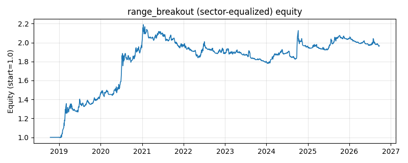

# 策略研究记录：range_breakout

> 类别/途径：**breakout** ｜ 类型：timing+sector_equalize ｜ 方向：只做多

## 一句话思路
[行业均衡] 区间突破 + 波动收缩过滤：收盘价突破过去 N 日震荡区间上沿（滚动最高价，用截至昨日的历史）做多，跌回区间中轴（(上沿+下沿)/2）离场；默认要求突破前区间相对宽度不高于其历史滚动分位（squeeze），即「横盘收窄后的突破」才入场，状态机持有降低换手。

## 收集途径 / 灵感来源
经典突破范式——价格区间（箱体）突破 + 波动收缩过滤（本仓库原创实现）。

## 核心假设
核心假设：长时间窄幅震荡代表供需平衡与筹码沉淀，波动收缩后的方向性突破更可能是信息驱动的真突破并延续为趋势（波动收缩形态 VCP / 挤压突破的思路）；离场用区间中轴而非下沿，在趋势衰竭初期即兑现，牺牲少量空间换取更低回撤。失效场景：无趋势的宽幅震荡市中区间上沿频繁被噪声刺穿（squeeze 过滤可部分缓解）；收缩过滤会漏掉波动扩张期的突破，V 型反转中反应滞后。

## 参数
- `window` = 20
- `use_squeeze` = True
- `squeeze_window` = 60
- `squeeze_q` = 0.5

## 实现要点
- 实现文件：`kairos_strategies/channels/breakout.py`（类名对应本策略）。
- 输出统一为「目标权重面板」(date × asset)，由 `Backtester` 滞后一期执行，杜绝未来函数。
- 仅使用 numpy/pandas，离线、确定性。

## 数据与回测设置
| 项 | 值 |
|---|---|
| 数据集 | ashare_real（38 资产） |
| 区间 | 2018-10-16 ~ 2026-09-23 |
| 期数 | 1930 |
| 年化基准期数 | 252 |
| 单边成本率 | 0.1000% |
| 无风险利率 | 0.00% |

## 回测结果
| 指标 | 值 |
|---|---|
| 累计收益 | 96.55% |
| 年化收益 (CAGR) | 9.22% |
| 年化波动 | 10.64% |
| 夏普 | 0.8821 |
| 索提诺 | 1.4094 |
| 最大回撤 | 18.69% |
| 卡玛 | 0.4935 |
| 胜率 | 50.22% |
| 盈利因子 | 1.2202 |
| 平均换手 | 0.0730 |
| 累计换手 | 140.81 |

## 净值曲线

## 结论与改进方向
- 结果为 **真实历史数据（ashare_real）回测演示，存在过拟合/幸存者偏差/样本区间依赖等局限**，不构成任何投资建议或收益承诺。
- 改进方向：在真实数据上重跑、参数敏感性分析、加入波动率目标/风控叠加、与其它策略做相关性分散。
