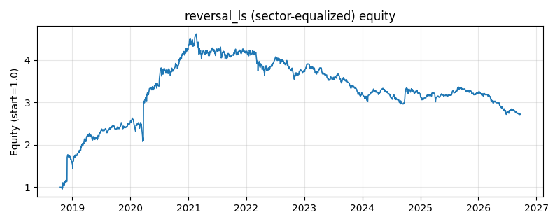

# 策略研究记录：reversal_ls

> 类别/途径：**long_short** ｜ 类型：cross_section+sector_equalize ｜ 方向：可多空

## 一句话思路
[行业均衡] 短期反转多空：按最近 lookback 日收益截面排序，做多近期跌得最多的 bottom 分位、做空近期涨得最多的 top 分位（分数 = -近端收益），两腿等权各占 0.5 预算，组合美元中性。

## 收集途径 / 灵感来源
多空股票 alpha 经典范式——短期反转 (short-term reversal) 的市场中性版本，本仓库原创实现；与 factor 渠道的 short_term_reversal（只做多超跌篮子）、statarb 渠道的 xs_zscore_reversion（对全篮子连续 z 配权）不同，此处是「top/bottom 分位各取一篮子、腿内等权」的分位多空形态。

## 核心假设
成因：短窗口（周级）价格变动里流动性冲击与过度反应成分大——被动抛压、止损盘与情绪化追涨把价格暂时推离短期均衡，做市商回补与套利资金随后推动修复：近端超跌者反弹、超涨者回吐，多空两端同时赚取这个截面收敛价差，市场方向被对冲掉。失效条件：短窗口涨跌由真实信息（业绩爆雷/超预期、并购）驱动时，跌者继续跌、涨者继续涨，反转变成「接飞刀」与「空逼空」；持续单边资金流/动量行情中信号长期为负；信号窗口短、换手高，交易成本与滑点可能吞掉毛 alpha；空头腿对被逼空的高波动标的风险不封顶。

## 参数
- `lookback` = 5
- `top_frac` = 0.3333333333333333
- `leg_budget` = 0.5

## 实现要点
- 实现文件：`kairos_strategies/channels/long_short.py`（类名对应本策略）。
- 输出统一为「目标权重面板」(date × asset)，由 `Backtester` 滞后一期执行，杜绝未来函数。
- 仅使用 numpy/pandas，离线、确定性。

## 数据与回测设置
| 项 | 值 |
|---|---|
| 数据集 | ashare_real（38 资产） |
| 区间 | 2018-10-16 ~ 2026-09-23 |
| 期数 | 1930 |
| 年化基准期数 | 252 |
| 单边成本率 | 0.1000% |
| 无风险利率 | 0.00% |

## 回测结果
| 指标 | 值 |
|---|---|
| 累计收益 | 172.12% |
| 年化收益 (CAGR) | 13.96% |
| 年化波动 | 27.83% |
| 夏普 | 0.5876 |
| 索提诺 | 1.5645 |
| 最大回撤 | 41.25% |
| 卡玛 | 0.3385 |
| 胜率 | 48.31% |
| 盈利因子 | 1.2063 |
| 平均换手 | 0.4046 |
| 累计换手 | 780.87 |

## 净值曲线

## 结论与改进方向
- 结果为 **真实历史数据（ashare_real）回测演示，存在过拟合/幸存者偏差/样本区间依赖等局限**，不构成任何投资建议或收益承诺。
- 改进方向：在真实数据上重跑、参数敏感性分析、加入波动率目标/风控叠加、与其它策略做相关性分散。
