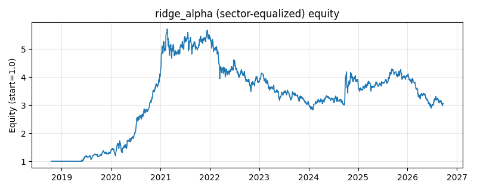

# 策略研究记录：ridge_alpha

> 类别/途径：**ml_signal** ｜ 类型：cross_section+sector_equalize ｜ 方向：只做多

## 一句话思路
[行业均衡] 自研岭回归（闭式解 (XᵀX+αI)⁻¹Xᵀy）walk-forward 预测下期收益：每 21 期用滚动 2 年窗口重训（只用已实现标签），按预测值截面排名做多前约 1/3 篮子，选中集内按分数线性加权，权重持有到下次重训。

## 收集途径 / 灵感来源
机器学习范式——岭回归（Hoerl–Kennard L2 正则最小二乘，闭式解），numpy.linalg 全自研实现，不使用任何第三方 ML 库。

## 核心假设
滞后收益/动量/波动/RSI/均线偏离等特征对下期收益存在弱而相对稳定的线性可预测性；L2 收缩把共线特征与噪声的系数整体压小，以微小偏差换取方差大幅下降，使小样本下的截面信号更稳健。当特征与收益的关系转为非线性、市场风格急切换或信噪比极低时失效，退化为近似等权噪声权重。

## 参数
- `alpha` = 25.0
- `refit` = 21
- `train_window` = 504
- `min_train_dates` = 126
- `top_frac` = 0.3333333333333333

## 实现要点
- 实现文件：`kairos_strategies/channels/ml_signal.py`（类名对应本策略）。
- 输出统一为「目标权重面板」(date × asset)，由 `Backtester` 滞后一期执行，杜绝未来函数。
- 仅使用 numpy/pandas，离线、确定性。

## 数据与回测设置
| 项 | 值 |
|---|---|
| 数据集 | ashare_real（38 资产） |
| 区间 | 2018-10-16 ~ 2026-09-23 |
| 期数 | 1930 |
| 年化基准期数 | 252 |
| 单边成本率 | 0.1000% |
| 无风险利率 | 0.00% |

## 回测结果
| 指标 | 值 |
|---|---|
| 累计收益 | 205.33% |
| 年化收益 (CAGR) | 15.69% |
| 年化波动 | 26.42% |
| 夏普 | 0.6836 |
| 索提诺 | 1.0304 |
| 最大回撤 | 50.42% |
| 卡玛 | 0.3112 |
| 胜率 | 49.66% |
| 盈利因子 | 1.1343 |
| 平均换手 | 0.0795 |
| 累计换手 | 153.45 |

## 净值曲线

## 结论与改进方向
- 结果为 **真实历史数据（ashare_real）回测演示，存在过拟合/幸存者偏差/样本区间依赖等局限**，不构成任何投资建议或收益承诺。
- 改进方向：在真实数据上重跑、参数敏感性分析、加入波动率目标/风控叠加、与其它策略做相关性分散。
