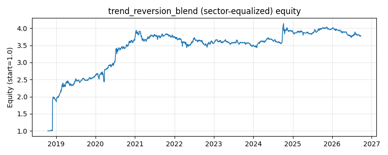

# 策略研究记录：trend_reversion_blend

> 类别/途径：**ensemble** ｜ 类型：cross_section+sector_equalize ｜ 方向：只做多

## 一句话思路
[行业均衡] 趋势-回归混合元策略：趋势腿取 technical 渠道 donchian_turtle（唐奇安通道突破），均值回归腿取 meanrev 渠道 zscore_reversion（滚动 z-score 回归，因其可多空，混合时只保留多头腿以维持 long_only），按固定 60%/40% 比例逐期线性叠加两者的目标权重面板，每行权重和 ≤ 0.6 + 0.4 = 1，无杠杆。

## 收集途径 / 灵感来源
元策略范式——趋势跟随与均值回归的风格混合（style blend / barbell of strategies）；两条腿分别复用本仓库 technical.DonchianTurtleStrategy 与 meanrev.ZscoreReversionStrategy 公开类，多头腿截取、固定比例混合与去杠杆为本渠道原创实现。

## 核心假设
核心假设：趋势型策略在单边行情盈利、在震荡市被反复止损；均值回归策略恰好相反——震荡市收割偏离、单边市逆势受损。两者收益在时间上互补（低相关甚至负相关），按固定 60/40 混合可在不预测市场 regime 的前提下平滑净值、降低最大回撤，同时以趋势腿为主保留上行捕获能力。失效场景：高波动无方向的跳空行情中两腿同时受损（突破即反转、偏离不回归）；固定比例不随 regime 自适应，若市场长期以某一风格为主，混合会持续跑输该风格的纯策略。

## 参数
- `weighting` = fixed_blend
- `trend_base` = donchian_turtle
- `reversion_base` = zscore_reversion
- `trend_weight` = 0.6
- `reversion_weight` = 0.4

## 实现要点
- 实现文件：`kairos_strategies/channels/ensemble.py`（类名对应本策略）。
- 输出统一为「目标权重面板」(date × asset)，由 `Backtester` 滞后一期执行，杜绝未来函数。
- 仅使用 numpy/pandas，离线、确定性。

## 数据与回测设置
| 项 | 值 |
|---|---|
| 数据集 | ashare_real（38 资产） |
| 区间 | 2018-10-16 ~ 2026-09-23 |
| 期数 | 1930 |
| 年化基准期数 | 252 |
| 单边成本率 | 0.1000% |
| 无风险利率 | 0.00% |

## 回测结果
| 指标 | 值 |
|---|---|
| 累计收益 | 278.30% |
| 年化收益 (CAGR) | 18.97% |
| 年化波动 | 33.70% |
| 夏普 | 0.6297 |
| 索提诺 | 3.3045 |
| 最大回撤 | 12.97% |
| 卡玛 | 1.4628 |
| 胜率 | 50.60% |
| 盈利因子 | 1.4702 |
| 平均换手 | 0.0860 |
| 累计换手 | 166.04 |

## 净值曲线

## 结论与改进方向
- 结果为 **真实历史数据（ashare_real）回测演示，存在过拟合/幸存者偏差/样本区间依赖等局限**，不构成任何投资建议或收益承诺。
- 改进方向：在真实数据上重跑、参数敏感性分析、加入波动率目标/风控叠加、与其它策略做相关性分散。
