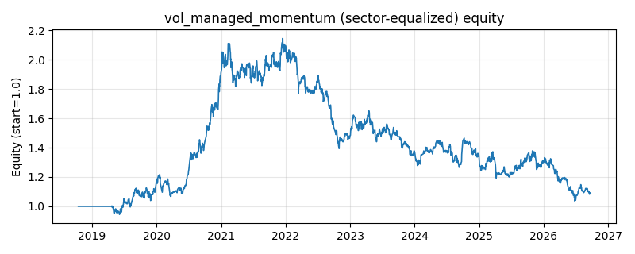

# 策略研究记录：vol_managed_momentum

> 类别/途径：**momentum_adv** ｜ 类型：cross_section+sector_equalize ｜ 方向：只做多

## 一句话思路
[行业均衡] 波动管理动量：先按截面动量做多强者构成动量组合（每行和≈1），再按**市场层**已实现波动对总敞口整体缩放（高波降杠杆、上限满仓不加杠杆），以控制动量崩溃；只做多、每行和≤1。

## 收集途径 / 灵感来源
进阶动量变体——波动管理动量 (volatility-managed momentum, Barroso-Santa-Clara / Moreira-Muir 思路，本仓库原创实现)；与 volatility 渠道的 vol_target（缩放对象是**等权组合**、名字不同）区别在于：此处缩放的是**截面动量组合**，目标是压制动量崩溃而非通用风险预算。

## 核心假设
针对动量的『崩溃 (momentum crash)』缺陷：截面动量在低波平稳期表现最好，而在高波/危机后的 V 型反弹期，因前期最弱者弹性最大而多头跑输、空头（此处不做空但组合整体）剧烈回撤。用市场已实现波动对动量组合整体缩放（高波降仓、低波满仓）能显著削薄尾部、提升夏普，且不加杠杆。失效条件：波动骤升后又快速回落时缩放滞后、踏空反弹；低波牛市里因缩放上限为 1 退化为满仓动量、相对无管理版没有超额；市场层波动是个股波动的粗糙代理。

## 参数
- `lookback` = 126
- `skip` = 21
- `top_frac` = 0.3333333333333333
- `vol_window` = 21
- `target_vol` = 0.15
- `max_scale` = 1.0
- `vol_floor` = 0.01

## 实现要点
- 实现文件：`kairos_strategies/channels/momentum_adv.py`（类名对应本策略）。
- 输出统一为「目标权重面板」(date × asset)，由 `Backtester` 滞后一期执行，杜绝未来函数。
- 仅使用 numpy/pandas，离线、确定性。

## 数据与回测设置
| 项 | 值 |
|---|---|
| 数据集 | ashare_real（38 资产） |
| 区间 | 2018-10-16 ~ 2026-09-23 |
| 期数 | 1930 |
| 年化基准期数 | 252 |
| 单边成本率 | 0.1000% |
| 无风险利率 | 0.00% |

## 回测结果
| 指标 | 值 |
|---|---|
| 累计收益 | 9.13% |
| 年化收益 (CAGR) | 1.15% |
| 年化波动 | 16.88% |
| 夏普 | 0.1521 |
| 索提诺 | 0.2137 |
| 最大回撤 | 51.75% |
| 卡玛 | 0.0222 |
| 胜率 | 50.94% |
| 盈利因子 | 1.0270 |
| 平均换手 | 0.1811 |
| 累计换手 | 349.49 |

## 净值曲线

## 结论与改进方向
- 结果为 **真实历史数据（ashare_real）回测演示，存在过拟合/幸存者偏差/样本区间依赖等局限**，不构成任何投资建议或收益承诺。
- 改进方向：在真实数据上重跑、参数敏感性分析、加入波动率目标/风控叠加、与其它策略做相关性分散。
