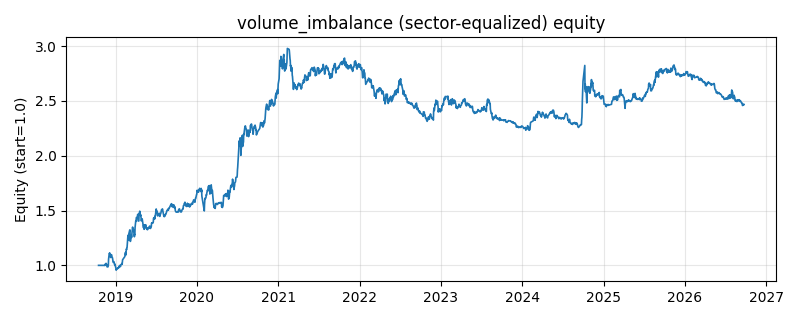

# 策略研究记录：volume_imbalance

> 类别/途径：**microstructure** ｜ 类型：timing+sector_equalize ｜ 方向：只做多

## 一句话思路
[行业均衡] 归一化 OBV 量价失衡：滚动窗口内上涨日成交量相对下跌日成交量占优（买压强）做多，卖压占优离场。

## 收集途径 / 灵感来源
微观结构/量价分析——OBV（能量潮）思想的原创归一化实现。

## 核心假设
成交量是价格运动的『确认票』：放量上涨说明知情买盘主导、趋势更可能延续，放量下跌或缩量上涨则预示动能衰竭。归一化的上/下行量比剔除了资产间量能规模差异，能刻画买卖净压方向。当市场处于无量单边行情、量能结构被外生事件（如指数调仓）扰动，或失衡比在阈值附近反复摆动时，信号会钝化并产生换手损耗。

## 参数
- `window` = 20
- `enter` = 0.2
- `exit` = -0.2

## 实现要点
- 实现文件：`kairos_strategies/channels/microstructure.py`（类名对应本策略）。
- 输出统一为「目标权重面板」(date × asset)，由 `Backtester` 滞后一期执行，杜绝未来函数。
- 仅使用 numpy/pandas，离线、确定性。

## 数据与回测设置
| 项 | 值 |
|---|---|
| 数据集 | ashare_real（38 资产） |
| 区间 | 2018-10-16 ~ 2026-09-23 |
| 期数 | 1930 |
| 年化基准期数 | 252 |
| 单边成本率 | 0.1000% |
| 无风险利率 | 0.00% |

## 回测结果
| 指标 | 值 |
|---|---|
| 累计收益 | 146.65% |
| 年化收益 (CAGR) | 12.51% |
| 年化波动 | 16.16% |
| 夏普 | 0.8102 |
| 索提诺 | 1.2132 |
| 最大回撤 | 25.08% |
| 卡玛 | 0.4989 |
| 胜率 | 50.92% |
| 盈利因子 | 1.1772 |
| 平均换手 | 0.0593 |
| 累计换手 | 114.37 |

## 净值曲线

## 结论与改进方向
- 结果为 **真实历史数据（ashare_real）回测演示，存在过拟合/幸存者偏差/样本区间依赖等局限**，不构成任何投资建议或收益承诺。
- 改进方向：在真实数据上重跑、参数敏感性分析、加入波动率目标/风控叠加、与其它策略做相关性分散。
