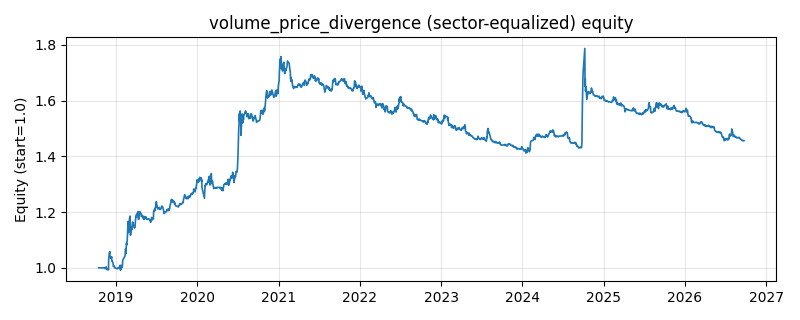

# 策略研究记录：volume_price_divergence

> 类别/途径：**microstructure** ｜ 类型：timing+sector_equalize ｜ 方向：只做多

## 一句话思路
[行业均衡] 量价背离：价涨量增（确认）按量能连续加权做多，价创新高但量缩（背离）清仓离场。

## 收集途径 / 灵感来源
微观结构/量价分析——经典『量在价先/背离』范式的原创连续权重实现。

## 核心假设
健康的上涨需要成交量确认：放量新高意味着新增资金入场、信息被广泛接受，趋势延续概率高；缩量新高说明追买意愿枯竭，是经典的顶部背离信号。按量比连续调仓（而非 0/1 开关）能让仓位与信号置信度成正比，降低阈值敏感性。当量能季节性萎缩（假期）、或上涨由低量能的逼空行情驱动时，确认/背离判别可能失真。

## 参数
- `mom_window` = 20
- `vol_window` = 20
- `high_window` = 20
- `vr_floor` = 0.5
- `vr_cap` = 1.5
- `div_ratio` = 0.9

## 实现要点
- 实现文件：`kairos_strategies/channels/microstructure.py`（类名对应本策略）。
- 输出统一为「目标权重面板」(date × asset)，由 `Backtester` 滞后一期执行，杜绝未来函数。
- 仅使用 numpy/pandas，离线、确定性。

## 数据与回测设置
| 项 | 值 |
|---|---|
| 数据集 | ashare_real（38 资产） |
| 区间 | 2018-10-16 ~ 2026-09-23 |
| 期数 | 1930 |
| 年化基准期数 | 252 |
| 单边成本率 | 0.1000% |
| 无风险利率 | 0.00% |

## 回测结果
| 指标 | 值 |
|---|---|
| 累计收益 | 45.66% |
| 年化收益 (CAGR) | 5.03% |
| 年化波动 | 9.45% |
| 夏普 | 0.5665 |
| 索提诺 | 0.9044 |
| 最大回撤 | 19.67% |
| 卡玛 | 0.2558 |
| 胜率 | 48.22% |
| 盈利因子 | 1.1523 |
| 平均换手 | 0.1560 |
| 累计换手 | 301.14 |

## 净值曲线

## 结论与改进方向
- 结果为 **真实历史数据（ashare_real）回测演示，存在过拟合/幸存者偏差/样本区间依赖等局限**，不构成任何投资建议或收益承诺。
- 改进方向：在真实数据上重跑、参数敏感性分析、加入波动率目标/风控叠加、与其它策略做相关性分散。
