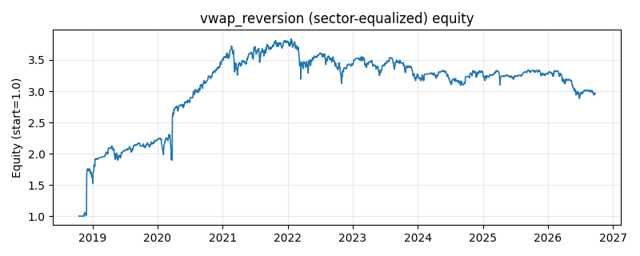

# 策略研究记录：vwap_reversion

> 类别/途径：**microstructure** ｜ 类型：timing+sector_equalize ｜ 方向：只做多

## 一句话思路
[行业均衡] VWAP 回归：价格显著低于滚动成交量加权均价做多，回到/高于 VWAP 离场（均值回归）。

## 收集途径 / 灵感来源
微观结构/量价分析——机构执行算法常用的 VWAP 锚，原创均值回归化实现。

## 核心假设
VWAP 是近期成交量的加权平均成本，代表市场共识价位：价格大幅折价于 VWAP 时，流动性提供者与价值买盘倾向入场修复偏离；量能加权的锚比等权均线更贴近真实换手成本，回归信号更可靠。当折价由持续基本面利空驱动（趋势性下跌）而非流动性冲击时，『接飞刀』会放大亏损；高成交量把 VWAP 快速拉向现价时信号也会变钝。

## 参数
- `window` = 20
- `enter_below` = -0.02
- `exit_above` = 0.0

## 实现要点
- 实现文件：`kairos_strategies/channels/microstructure.py`（类名对应本策略）。
- 输出统一为「目标权重面板」(date × asset)，由 `Backtester` 滞后一期执行，杜绝未来函数。
- 仅使用 numpy/pandas，离线、确定性。

## 数据与回测设置
| 项 | 值 |
|---|---|
| 数据集 | ashare_real（38 资产） |
| 区间 | 2018-10-16 ~ 2026-09-23 |
| 期数 | 1930 |
| 年化基准期数 | 252 |
| 单边成本率 | 0.1000% |
| 无风险利率 | 0.00% |

## 回测结果
| 指标 | 值 |
|---|---|
| 累计收益 | 196.80% |
| 年化收益 (CAGR) | 15.26% |
| 年化波动 | 28.21% |
| 夏普 | 0.6189 |
| 索提诺 | 1.7759 |
| 最大回撤 | 24.90% |
| 卡玛 | 0.6129 |
| 胜率 | 49.44% |
| 盈利因子 | 1.2742 |
| 平均换手 | 0.1283 |
| 累计换手 | 247.60 |

## 净值曲线

## 结论与改进方向
- 结果为 **真实历史数据（ashare_real）回测演示，存在过拟合/幸存者偏差/样本区间依赖等局限**，不构成任何投资建议或收益承诺。
- 改进方向：在真实数据上重跑、参数敏感性分析、加入波动率目标/风控叠加、与其它策略做相关性分散。
