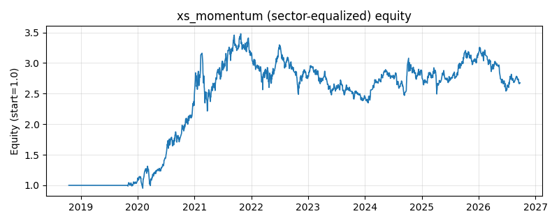

# 策略研究记录：xs_momentum

> 类别/途径：**momentum** ｜ 类型：cross_section+sector_equalize ｜ 方向：只做多

## 一句话思路
[行业均衡] 截面动量(12-1)：按剔除最近 skip 期的较长窗口收益做截面排名，做多排名前约 1/3 并等权归一。

## 收集途径 / 灵感来源
动量范式——横截面动量 / 12-1（Jegadeesh-Titman 思路，原创实现）。

## 核心假设
相对强势资产倾向继续跑赢（横截面动量）；剔除最近一期规避短期反转污染；在动量崩溃/风格急切换时失效。

## 参数
- `lookback` = 252
- `skip` = 21
- `top_frac` = 0.3333333333333333

## 实现要点
- 实现文件：`kairos_strategies/channels/momentum.py`（类名对应本策略）。
- 输出统一为「目标权重面板」(date × asset)，由 `Backtester` 滞后一期执行，杜绝未来函数。
- 仅使用 numpy/pandas，离线、确定性。

## 数据与回测设置
| 项 | 值 |
|---|---|
| 数据集 | ashare_real（38 资产） |
| 区间 | 2018-10-16 ~ 2026-09-23 |
| 期数 | 1930 |
| 年化基准期数 | 252 |
| 单边成本率 | 0.1000% |
| 无风险利率 | 0.00% |

## 回测结果
| 指标 | 值 |
|---|---|
| 累计收益 | 167.80% |
| 年化收益 (CAGR) | 13.73% |
| 年化波动 | 23.75% |
| 夏普 | 0.6608 |
| 索提诺 | 0.9612 |
| 最大回撤 | 32.51% |
| 卡玛 | 0.4222 |
| 胜率 | 50.18% |
| 盈利因子 | 1.1333 |
| 平均换手 | 0.1600 |
| 累计换手 | 308.75 |

## 净值曲线

## 结论与改进方向
- 结果为 **真实历史数据（ashare_real）回测演示，存在过拟合/幸存者偏差/样本区间依赖等局限**，不构成任何投资建议或收益承诺。
- 改进方向：在真实数据上重跑、参数敏感性分析、加入波动率目标/风控叠加、与其它策略做相关性分散。
