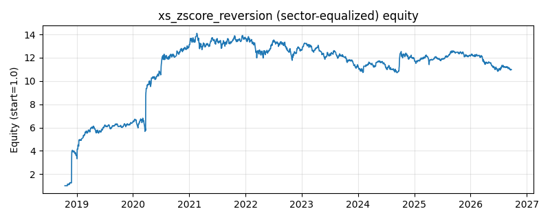

# 策略研究记录：xs_zscore_reversion

> 类别/途径：**statarb** ｜ 类型：cross_section+sector_equalize ｜ 方向：可多空

## 一句话思路
[行业均衡] 截面 z-score 反转：每期把各资产尾部 lookback 日收益做截面标准化（减截面均值、除截面标准差）得到相对强弱 z，做多截面偏弱(z 低)、做空截面偏强(z 高)的一篮子，z 经短窗口尾部平滑后按 -z 配权并逐行去均值，构成美元中性的全篮子多空组合。

## 收集途径 / 灵感来源
统计套利经典范式——截面标准化反转（cross-sectional z-score reversal）。本仓库原创实现：与 factor 渠道的 short_term_reversal（只做多、取排名前 1/3）和 meanrev 渠道的 zscore_reversion（单资产时序 z、择时）在信号构造与组合形态上均不同，此处是**全篮子市场中性**的截面版本。

## 核心假设
核心假设：同一截面内短期相对涨跌包含过度反应与流动性冲击成分，近端相对弱势者倾向反弹、相对强势者倾向回吐，故反向持仓可赚取截面收敛；由于同时多空，市场beta 被对冲掉，收益来源是截面离散度而非方向。失效场景：截面动量行情（强者恒强的行业主题/资金抱团）中反转持续为负；截面资产太少或高度同质时 z 的区分度不足，信号被交易成本吞噬。

## 参数
- `lookback` = 10
- `smooth` = 3
- `z_cap` = 3.0
- `budget` = 1.0

## 实现要点
- 实现文件：`kairos_strategies/channels/statarb.py`（类名对应本策略）。
- 输出统一为「目标权重面板」(date × asset)，由 `Backtester` 滞后一期执行，杜绝未来函数。
- 仅使用 numpy/pandas，离线、确定性。

## 数据与回测设置
| 项 | 值 |
|---|---|
| 数据集 | ashare_real（38 资产） |
| 区间 | 2018-10-16 ~ 2026-09-23 |
| 期数 | 1930 |
| 年化基准期数 | 252 |
| 单边成本率 | 0.1000% |
| 无风险利率 | 0.00% |

## 回测结果
| 指标 | 值 |
|---|---|
| 累计收益 | 997.50% |
| 年化收益 (CAGR) | 36.72% |
| 年化波动 | 66.56% |
| 夏普 | 0.6540 |
| 索提诺 | 4.2662 |
| 最大回撤 | 24.01% |
| 卡玛 | 1.5293 |
| 胜率 | 50.10% |
| 盈利因子 | 1.5730 |
| 平均换手 | 0.1512 |
| 累计换手 | 291.82 |

## 净值曲线

## 结论与改进方向
- 结果为 **真实历史数据（ashare_real）回测演示，存在过拟合/幸存者偏差/样本区间依赖等局限**，不构成任何投资建议或收益承诺。
- 改进方向：在真实数据上重跑、参数敏感性分析、加入波动率目标/风控叠加、与其它策略做相关性分散。
